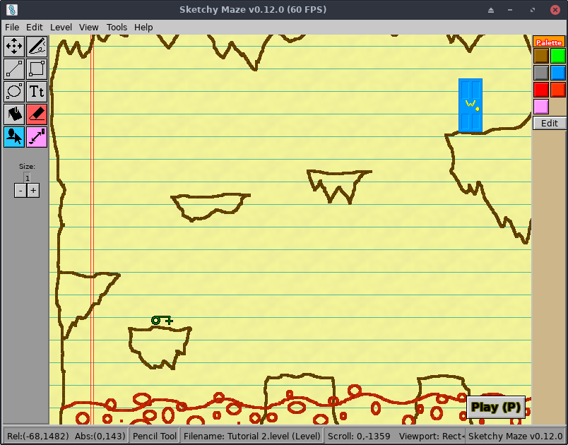

# About _Sketchy Maze_

**Sketchy Maze** is a "drawing-based maze game" themed around hand-drawn maps
on paper.

You can draw your own custom maps, freehand or with some basic drawing tools,
and then drag and drop pre-made "[doodads](doodads.md)" into your level for
interactive things like keys, doors and buttons.

This is an **early alpha build** of the game. Longer term it will include a couple
of built-in "single player campaigns" of multiple themed levels, but for now it
just includes a few example levels and the editor itself.

## Inspiration

When I was a kid in the era of Sega Genesys and Super Nintendo, I liked to
draw my own levels with pen and paper and "play" them with my imagination. My
"mouse mazes" had all sorts of features borrowed from videogames I liked.
There were buttons that the player had to push that would open a door far
across the level (and I'd draw a little dotted line showing the connection
between the button and the door). Trapdoors would have the player fall through
and then close behind them so they can't go back. Keys in different shapes
could unlock doors in similar shapes (you'd just have to remember which keys
you've got!)

When you're drawing with a pen and paper, the level can be anything you want.
You can draw a castle or a cave, place little gizmos and traps throughout the
level (doors, keys, buttons and things) and create puzzles. Do you want the red
pixels to mean "fire" and burn the player? Or do you want to decorate the tops
of "bloody" spikes with red? Either way, the 'fire' attribute on that color will
do the job and you can draw whatever shape you want for your level hazards.

## Mod Friendly

While the game ships with a [handful of built-in doodads](doodads.md) to
spice up your level, you can also create your own and program them to do
whatever you want, with JavaScript!
