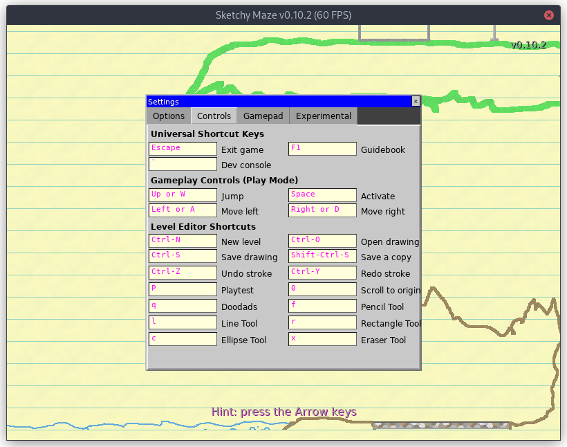

# Controls

**Sketchy Maze** currently uses a mouse and keyboard for inputs, but eventually
will be usable from gamepad controllers, especially if it branches out and
targets platforms other than desktop computers in the future.

The list of controls is also viewable in-game in the Settings Window, accessible
from the title screen or the Edit->Settings menu of the editor. The controls can
not be customized at this time.

## During Gameplay

While playing a level, the following keys are used to control the player character:

* **Left** and **Right** arrow keys move the player left or right.
* **Up** arrow to make the player jump.
* **Space Bar** is used to "activate" certain doodads. Currently, only the
  [Warp Doors](doodads.md#warp-doors) require deliberate activation; Buttons and
  Switches activate _automatically_ when the player character (or other mobile
  doodad) touches them.

## Hotkeys

See the [Hotkeys](hotkeys.md) page for shortcut keys, especially around the
Level Editor feature.
