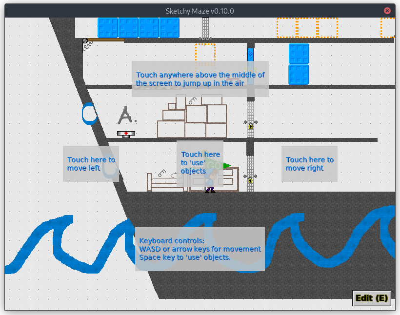

# Controls

**Sketchy Maze** can be played with a variety of input devices including keyboard & mouse, touch screen, or Xbox-style game controllers.

The list of controls is also viewable in-game in the Settings Window, accessible from the title screen or the Edit->Settings menu of the editor. The controls can not be customized at this time.

## Gamepad Controls

An Xbox-style game controller can be used with Sketchy Maze. Nintendo-style controllers also work, such as a Switch Pro Controller. The game has a built-in "X Style" or "N Style" setting to make sure the A/B and X/Y buttons map correctly based on your controller. You can choose which button style you prefer in the game's Settings window.

The gamepad controls currently operate under two different "modes" which are described below.

### Mouse Mode

The default gamepad controls will emulate a mouse cursor, allowing you to navigate the game's screens and work with the Level Editor. Under Mouse Mode, the gamepad controls are as follows:

*   The **Left analog stick** moves a mouse cursor around the screen.
*   The **Right analog stick** can scroll the level on the title screen or editor.
*   The **A** and **X** buttons act as a "left click" to activate buttons and draw pixels in the level editor.
*   The **B** and **Y** buttons act as a "right click," e.g. to remove doodads from your level while the Doodad Tool is selected.
*   The **Left shoulder** button (L1) acts as a "middle click", e.g. to pan the level around on the title screen or editor.
*   The **Left trigger** button (L2) will close the top-most popup window in the level editor (similar to the Backspace key on keyboard controls).

### Gameplay Mode

When level gameplay begins, the game controller will move the player character around using familiar controls.

*   The **Left analog stick** and the **D-Pad** will move the player character left or right. If playing as the Bird or under the effects of antigravity, the control stick can also move the player up and down.
*   The **A** and **X** buttons are to "Use" an object, such as to open a Warp Door.
*   The **B** and **Y** buttons are to "Jump"
*   The **Right shoulder** button (R1) toggles the gamepad controls between Gameplay Mode and Mouse Mode. So, during gameplay you may access the menu bar or on-screen buttons by toggling into Mouse Mode.

## Touch Controls

Buttons and UI windows can be touched and dragged around as though your finger is a mouse cursor. There are also some gestures supported:

*   Drag two fingers across the screen to **pan a scrollable drawing** such as in the Level Editor or the Title Screen.
    *   Tip: for the Level Editor select the Actor Tool or Link Tool before panning the level, otherwise you might plot some pixels on your map before the game realizes you were just wanting to scroll!

During gameplay, touch any region of the screen surrounding the center to move the player character in the relative direction you touched. By default, if you are idle in a level for a few seconds some on-screen hints will appear about the touch controls:

The square in the middle that says "Touch here to 'use' objects" is the center of your screen and all the other touch regions are directly touching this square.

*   Touch anywhere above center to **Jump.**
*   Touch anywhere left of center to **Move left.**
*   Touch anywhere right of center to **Move right.**
*   Touch anywhere below center to **Move downwards.** (note: for flying characters like the Bird or during times of antigravity)
*   Touch the center to **Use** objects (such as to open a Warp Door).

Generally the center is aligned on the player character unless you're close to level boundaries.

## Keyboard Controls (Gameplay)

While playing a level, the following keys are used to control the player character:

*   **Left** and **Right** arrow keys move the player left or right.
*   **Up** arrow to make the player jump.
*   **Space Bar** is used to "activate" certain doodads. Currently, only the [Warp Doors](doodads.md#warp-doors) require deliberate activation; Buttons and Switches activate _automatically_ when the player character (or other mobile doodad) touches them.

## Hotkeys

See the [Hotkeys](hotkeys.md) page for shortcut keys, especially around the Level Editor feature.
