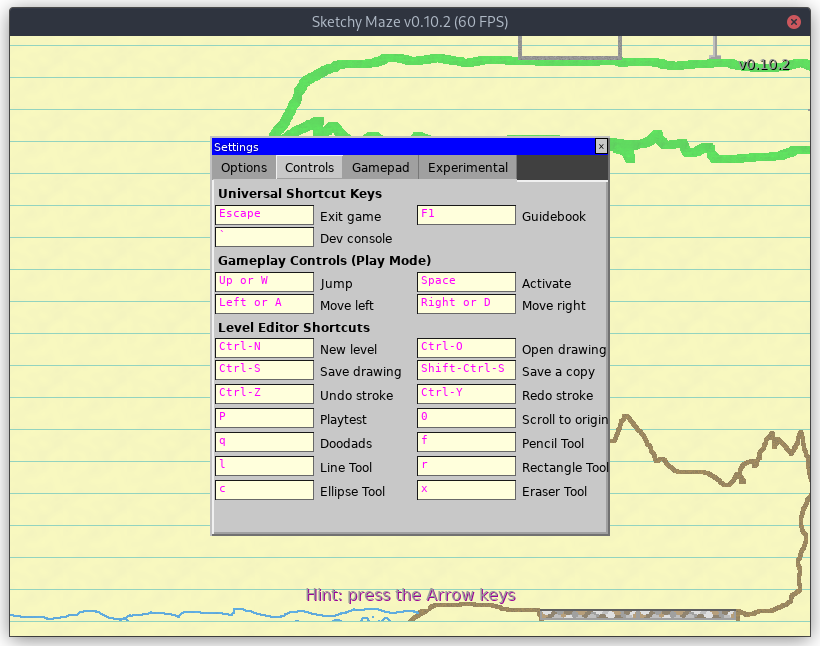
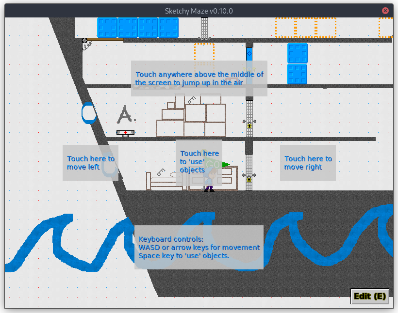

# Controls

**Sketchy Maze** currently uses a mouse and keyboard or touch screen for input,
but eventually will be usable from gamepad controllers.

The list of controls is also viewable in-game in the Settings Window, accessible
from the title screen or the Edit->Settings menu of the editor. The controls can
not be customized at this time.

## Touch Controls

Buttons and UI windows can be touched and dragged around as though your finger
is a mouse cursor. There are also some gestures supported:

* Drag two fingers across the screen to **pan a scrollable drawing** such as
  in the Level Editor or the Title Screen.
    * Tip: for the Level Editor select the Actor Tool or Link Tool before
      panning the level, otherwise you might plot some pixels on your map
      before the game realizes you were just wanting to scroll!

During gameplay, touch any region of the screen surrounding the center to move
the player character in the relative direction you touched. By default, if you
are idle in a level for a few seconds some on-screen hints will appear about
the touch controls:

The square in the middle that says "Touch here to 'use' objects" is the center
of your screen and all the other touch regions are directly touching this square.

* Touch anywhere above center to **Jump.**
* Touch anywhere left of center to **Move left.**
* Touch anywhere right of center to **Move right.**
* Touch anywhere below center to **Move downwards.** (note: for flying characters
  like the Bird or during times of antigravity)
* Touch the center to **Use** objects (such as to open a Warp Door).

Generally the center is aligned on the player character unless you're close to
level boundaries.

## Keyboard Controls (Gameplay)

While playing a level, the following keys are used to control the player character:

* **Left** and **Right** arrow keys move the player left or right.
* **Up** arrow to make the player jump.
* **Space Bar** is used to "activate" certain doodads. Currently, only the
  [Warp Doors](doodads.md#warp-doors) require deliberate activation; Buttons and
  Switches activate _automatically_ when the player character (or other mobile
  doodad) touches them.

## Hotkeys

See the [Hotkeys](hotkeys.md) page for shortcut keys, especially around the
Level Editor feature.
