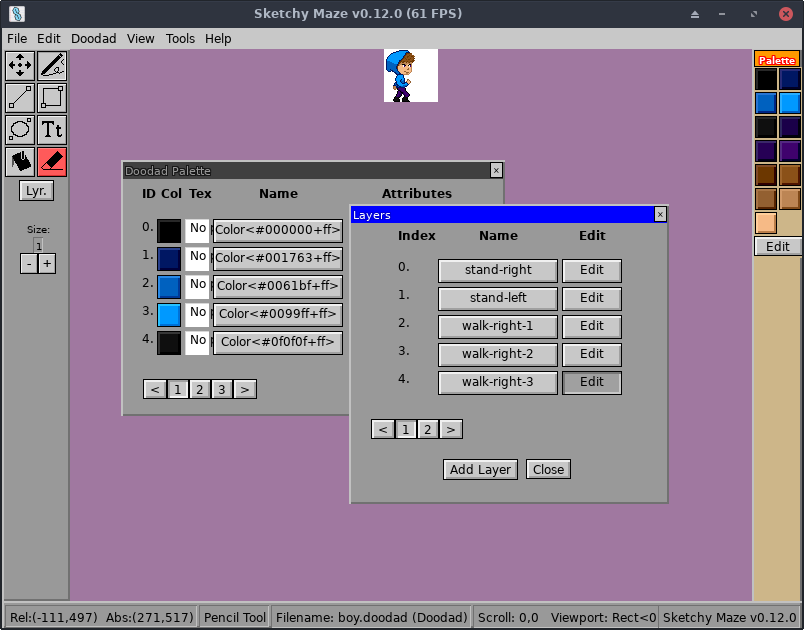

# Drawing a Doodad In-Game

Sketchy Maze has support for drawing your custom doodad sprites in-game,
although for now you may find it more comfortable to use an
[external image editor](edit-external.md) instead.

To start a new doodad, open the game and enter the level editor. Select the
"File -> New Doodad" menu at the top of the screen. You will be prompted for
the square dimensions of your doodad (i.e. `100` for a 100x100 sprite) and
you can begin editing.

## Doodad Properties

The "Doodad -> Doodad Properties" menu brings up the properties window for
the doodad you're editing:

This window has many useful features which (prior to v0.8.0) used to only be
available on the [`doodad` tool](../doodad-tool.md):

* Metadata: you can modify the Title, Author and Hitbox fields.
* Doodad Script: you can view, upload and delete a JavaScript source for
  your doodad.
* Generic Scripts: some built-in scripts to easily make useful doodads
  without needing to write _any_ code!
* Tags: manage the key/value tag store on the doodad. Tags hold configuration
  data that the JavaScript sometimes wants, or some tags have special meaning
  to the game such as "category" (see below).

## Generic Doodad Scripts

The game includes a few "generic" scripts that you can _easily_ attach to
your doodad. From the Doodad Properties window, click into the select box
and choose from the built-in scripts. A confirmation window will explain
the script and if you want to attach it to your doodad.

### Generic Solid

The Hitbox of your doodad will behave as a solid object in-game. Mobile
doodads can walk on top of it.

### Generic Fire

The Hitbox of your doodad acts just like fire pixels: it will "burn" mobile
doodads and it will harm the player character, failing the level.
"Watch out for (doodad title)!"

### Generic Anvil

Draw your own version of the Anvil! Your doodad does not have a solid hitbox,
and is perfectly harmless, except it falls with gravity and becomes deadly
while falling. It destroys any mobile doodad that it falls on and, if it's
the player character, fails the level.

### Generic Collectible Item

Your doodad will behave similarly to the Keys and can be "picked up" by the
player or other doodad with an inventory. Its sprite will appear in the
Inventory HUD in-game. Be careful on your sprite size, the inventory HUD
grows to accommodate the largest item sprite size!

## Setting the Category Tag

In the Level Editor, the Doodad Dropper window shows a categorical tab frame
with options like "Objects, Gizmos, Doors, Creatures, All"

Your custom doodads will only appear in the "All" tab by default. To put your
doodad into one of the official category tabs, add a tag named "category"
holding one of these values: objects, gizmos, doors, or creatures (all
lowercase).

You may comma separate multiple categories. Unrecognized categories are
ignored - your doodad always appears on the All tab regardless.

## Layers

A key difference between Levels and Doodads are that Doodad drawings can have
multiple **layers**. For doodads these are used to store multiple frames of
animation or different states, such as an opened vs. closed door.

Clicking the **Lyr.** button on the left toolbar or the "Doodad -> Layers"
menu will open the Layers window where you can switch your editor between
layers, add and rename them. Layers can be toggled by the doodad's
[JavaScript code](scripts.md) by index number or by name, so giving each layer
a descriptive name is useful.

Doodads saved in-game go in your [user config directory](../profile-directory.md)
on your system.

