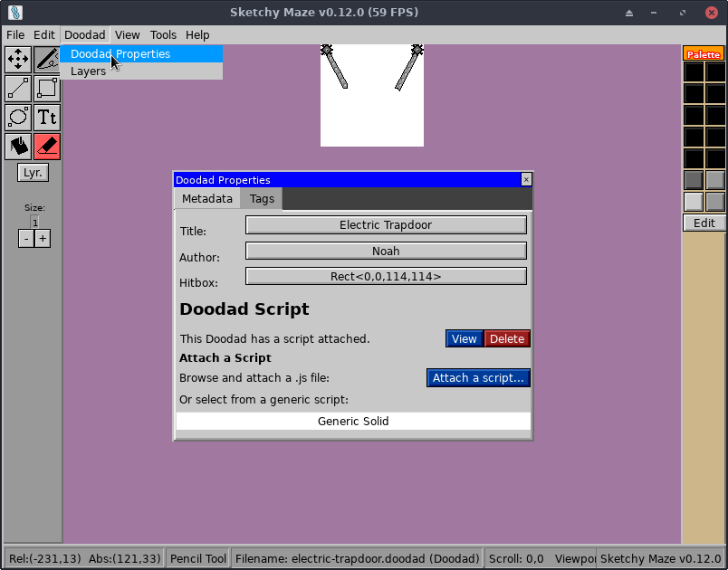

# Doodad Scripts

Doodads are programmed using (ES5) JavaScript which gives them their behavior
and ability to interact with the player and other doodads. Doodad scripts are
run during "Play Mode" when a level _containing_ the doodad is being played.

The main() function of your script is called to initialize your doodad. Here
is an example what a doodad script may look like:

```javascript
function main() {
    // Logs go to the game's log file (standard output on Linux/Mac).
    console.log("%s initialized!", Self.Title);

    // NOTE: you can configure the hitbox in the editor, this function
    // can define it in script. This box marks the region you want to
    // be 'solid' or whatever, the hot spot of your doodad.
    Self.SetHitbox(0, 0, 64, 12);

    // Handle a collision when another doodad (or player) has entered
    // the space of our doodad. The `e` has info about the event.
    Events.OnCollide((e) => {
        console.log("Actor %s has entered our hitbox!", e.Actor.ID());

        // InHitbox is `true` if we defined a hitbox for ourselves, and
        // the colliding actor is inside of the hitbox we defined.
        // To prohibit movement, return false from the OnCollide handler.
        // If you don't return false, the actor is allowed to keep on
        // moving through.
        if (e.InHitbox) {
            return false;
        }

        // When movement is finalized, OnCollide is called one final time
        // with e.Settled=true; it is only then that a doodad should run
        // event handlers for a logical collide event.
        if (e.Settled) {
            // do something
            Message.Publish("power", true);
        }
    });

    // Subscribe to "broadcast:ready" and don't publish messages
    // until the game is ready!
    Message.Subscribe("broadcast:ready", () => {
        // It is now safe to publish messages to linked doodads, something that
        // could have deadlocked otherwise!
        Message.Publish("ping", null);
    })

    // OnLeave is called when an actor, who was previously colliding with
    // us, is no longer doing so.
    Events.OnLeave((e) => {
        console.log("Actor %s has stopped colliding!", e.Actor.ID());
    })
}
```

## Installing a Doodad Script

Scripts can be attached to your doodad either in-game (using the Doodad
Properties window in the editor) or by using the command-line `doodad` program.



Using the command-line [`doodad` tool](../doodad-tool.md):

```bash
# Attach the JavaScript at "script.js" to the doodad file "filename.doodad"
doodad install-script script.js filename.doodad

# To view the script currently attached to a doodad
# (prints the script to your terminal)
doodad show --script filename.doodad
```

## Testing Your Script

The best way to test your doodad script is to use it in a level!

Run the game in a console to watch the log output, and you can use functions
like `console.log()` in your script to help debug issues. Drag your custom
doodad into a level and playtest it! Your script's main() function is called
when the level instance of your doodad is initialized.

## JavaScript API

Please see the [Script API Reference](api-reference.md) for full details.