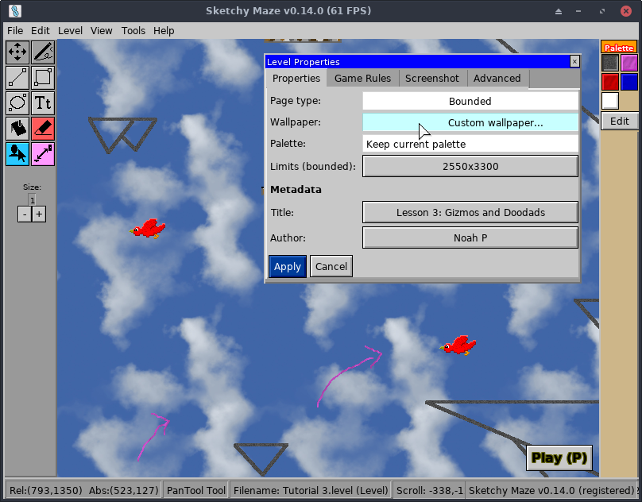
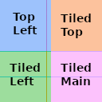
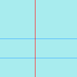
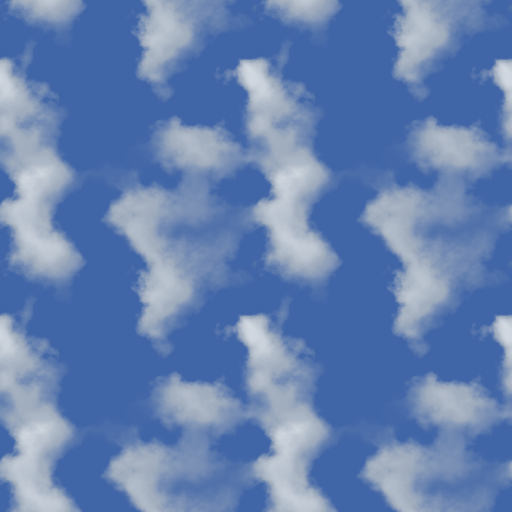

# Custom Wallpaper



Sketchy Maze v0.6.0 introduces the ability to use your own custom wallpaper
image to go behind your level.

You may use any common image type (PNG, JPEG, or GIF) as a wallpaper image and
it will be tiled across your level following the game's rules. For best results,
a wallpaper image should be crafted according to the guidelines on this page.

## How Wallpapers Work

Any (reasonably) sized image will work as a wallpaper, depending on the
resolution you need. The image does not need to be square. The game will
divide your wallpaper image into four quadrants:



The above image is the game's default Notebook wallpaper with the four quadrants
of the image highlighted. The game will slice your wallpaper into four equal
quarters and tile them depending on a level's Page Type. Rectangular wallpapers
work fine too, just the quadrants will also be rectangular.

The bottom-right quadrant (**Tiled Main**) is the main repeating background image
that covers the entire level. Unbounded levels will use _only_ this part of the
wallpaper.

Levels that have a top-left corner (Bounded and No Negative Space) will draw
from the other three quadrants when decorating these edges of the level:

* **Top Left:** the top-left corner of the page; drawn exactly one time per
  level, where it is anchored to the top-left (0,0) coordinate of the level.
* **Tiled Top:** the top margin of the page; tiled horizontally across the entire
  top edge of the level.
* **Tiled Left:** the left margin of the page; tiled vertically across the entire
  left edge of the level.

## Making a Simple Tiled Wallpaper

If you already have a tiled pattern you want to use as a wallpaper, and want
the simplest way to use that pattern with Sketchy Maze, the quick steps are:

1. Suppose your original texture is 64x64 pixels and it tiles in all directions.
2. Create a new image twice the size of the original (128x128 pixels), and
   copy/paste your texture into it 4 times. So you now have a 128x128 version of
   your original 64x64 and it tiles all the same.
3. Pick your new 128x128 texture in Sketchy Maze.

If you have ImageMagick handy at the command line, this command would do this
up-tiling work:

```bash
# where clouds.jpg was a 512x512 pixel repeating texture,
# create a twice-size image tiled from the original, now
# you have a 1024x1024 up-tiled version of the original.
convert -size 1024x1024 tile:clouds.jpg clouds-2x.jpg
```

## Example Wallpapers

Here are a couple of examples you can use. Right-click and save these images
and then select them as your custom wallpaper in Sketchy Maze:

### Blue Notebook



A light blue version of the default Notebook paper.

### Clouds



The wallpaper used in the screenshot at the top of this page. Full-color
JPEG quality photos work fine as wallpapers. This image was created via the
[Making a Simple Tiled Wallpaper](#making-a-simple-tiled-wallpaper) process
detailed above.

## Extracting Wallpapers

Getting a wallpaper back _out_ of a level is not currently an easy task, but
it can be done using the [`doodad` tool](../doodad-tool.md) on the command line
to inspect your level file.

Your custom levels are saved in your [profile directory](../profile-directory.md),
so point the `doodad` command at your files therein. The `doodad show` command
will show if a level has any attached files, such as wallpaper images:

```bash
$ doodad show example.level
===== Level: example.level =====
Headers:
  File version: 1
  Game version: 0.6.0-alpha
   Level title: Alpha
        Author: kirsle
      Password:
        Locked: false

Palette:
  - Swatch name: solid
    Attributes:  solid
    Color:       #000000
  - Swatch name: decoration
    Attributes:  none
    Color:       #999999
  - Swatch name: fire
    Attributes:  fire
    Color:       #ff0000
  - Swatch name: water
    Attributes:  water
    Color:       #0000ff

Level Settings:
  Page type: Bounded
   Max size: 2550x3300
  Wallpaper: custom.b64img

Attached Files:
  assets/wallpapers/custom.b64img: 1156 bytes

Actors:
  Level contains 0 actors
  Use -actors or -verbose to serialize Actors

Chunks:
  Pixels Per Chunk: 128^2
  Number Generated: 0
  Coordinate Range: (0,0) ... (127,127)
  World Dimensions: 127x127
  Use -chunks or -verbose to serialize Chunks
```

The "Attached Files:" section shows the names and sizes of any files embedded
in the level, or "None" if none.

You can get the data of an attached file with `doodad show --attachment=<file>`:

```bash
$ doodad show --attachment=assets/wallpapers/custom.b64img example.level
```

The image is encoded in Base64 so the above command would spit out a bunch
of random numbers and letters. If you pipe it into a base64 decoder you can
save it as an image file:

```bash
# (the -a is a shortcut for --attachment)
$ doodad show -a assets/wallpapers/custom.b64img example.level | base64 -d > out.png
```

Future releases of the game may make this process easier.
