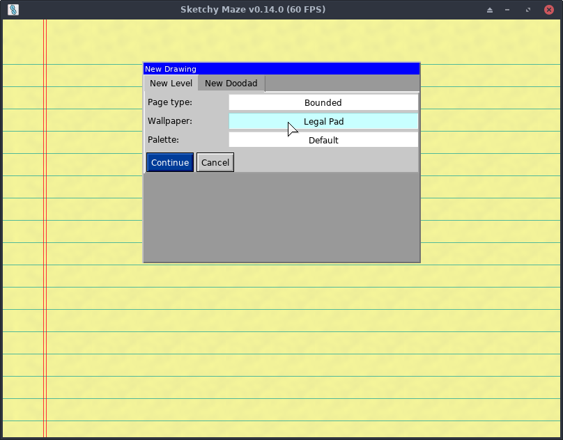
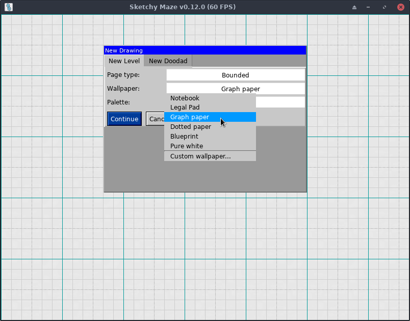
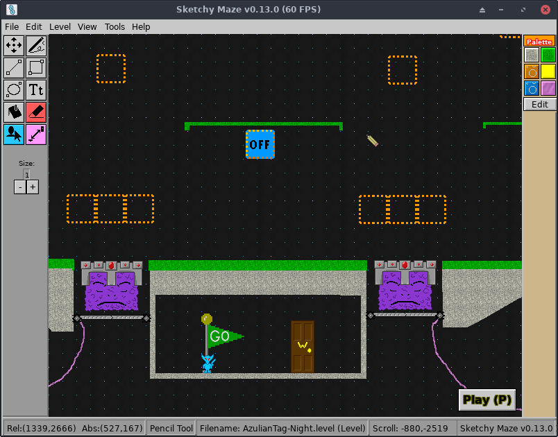
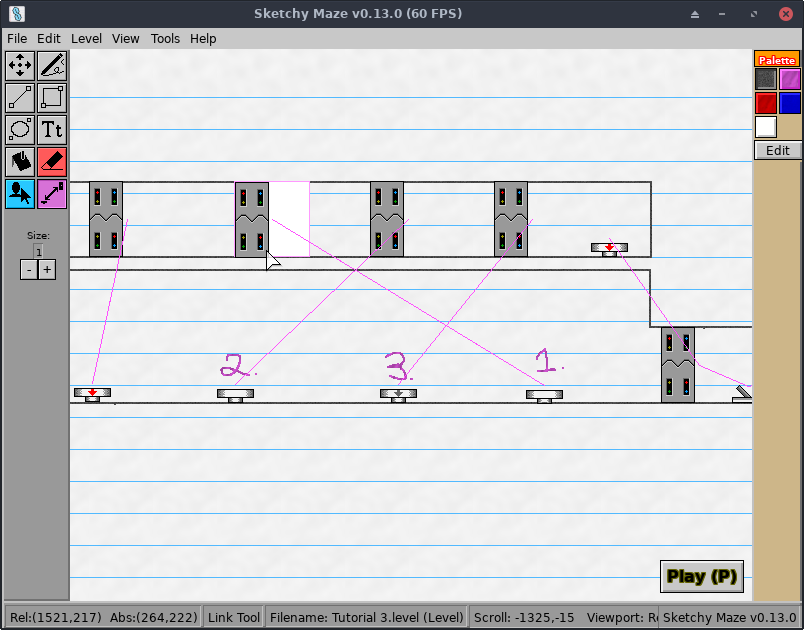
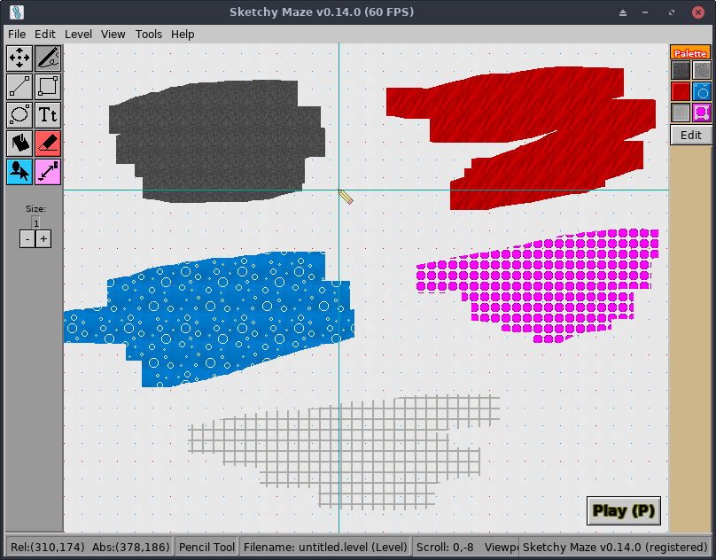
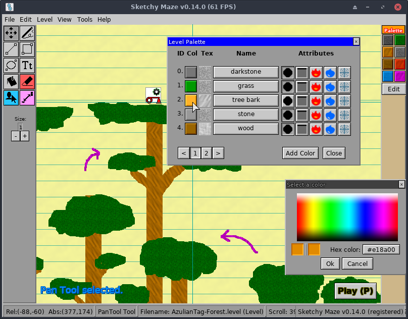

# Creating Custom Levels

One of the core gameplay features is the Level Editor which lets you draw your own custom maps to play and share with others.

From the game's Main Menu, click on the "Create a Level" button to open the level editor. To edit an existing custom level, click on the "Edit a Level" button instead.

## Level Properties

When creating a new level, you first choose some settings for it. These are described below:

### Page Type

This setting controls the size and boundaries of your level, and control the appearance of the notebook paper background of your level.

*   **Bounded** is the default. The camera won't scroll past the top-left corner of the page (0,0), and the level size is capped to 2550x3300, or the approximate size of an 11:9 standard sheet of notebook paper in pixels. You can adjust the boundary size later if you need more room!
*   **No Negative Space** is like Bounded, but the width and height of the level have no boundary. Levels can grow "infinitely" to the right and downward but no negative coordinates past the top or left edge.
*   **Unbounded** allows for "infinite" sized maps that give unlimited room to grow your level. The wallpaper on this level type only uses the "tiling" pattern, so notebook-themed levels won't show the top/left decorations.

You can change these settings later if you change your mind.

### Wallpaper

The wallpaper affects the "theme" of your level. Sketchy Maze is themed around hand-drawn mazes on paper, so the built-in themes look like various kinds of paper.

*   **Notebook** looks like standard ruled notebook paper. It's a white paper with blue horizontal lines, a single red vertical line down the left, and a wide margin on the top and left edges.
*   **Legal Pad** looks like ruled yellow legal pad. It's similar to Notebook but has yellow paper and a second vertical red line down the left.
*   **Graph paper** `new in v0.6.0` is a white paper with a repeating grid pattern of light-grey lines about 32px each; a darker dotted gray grid every 3x3 units; and a teal grid every 6x6 units. A light version of Blueprint.
*   **Dotted paper** `new in v0.6.0` is a white page with a repeating pattern of single dots every 32 pixels apart. Most dots are light blue but with a grid of red dots every 6x6 units. It has the same grid spacing as the Graph paper.
*   **Blueprint** is a dark blueprint paper background with a repeating grid pattern. A dark version of Graph paper; you'll want to pair it with the **Blueprint Palette** which has light colors for level geometry by default.
*   **Pure White** is a blank, white (#FFFFFE) background color with nothing going on except for what you draw on your level.
*   **Custom wallpaper...** lets you use your own wallpaper image. See [Custom Wallpaper](custom-wallpaper.md).

The decorations of the wallpaper vary based on the Page Type. For example, the Notebook and Legal Pad have extra padding on the top of the page and red lines going down just the left side, and the rest of the level uses the repeating blue lines pattern. The page types and their effect on the wallpapers are:

*   **Bounded** and **No Negative Space** will show the decorations for the top and left edges of the page, as these levels are bounded on their top/left corner.
*   **Unbounded** levels only use the repeating tiled pattern across the entire level, because there is no top-left boundary to anchor those decorations to.

### Default Palette

When starting a **new** level, you may choose a default Palette to start out with. The available options as of **version 0.10.0** are:

*   **Default:** the classic palette from previous alpha game releases.
    1.  **solid**: black, solid geometry
    2.  **decoration**: light grey
    3.  **fire**: red, fire
    4.  **water**: blue, water
    5.  **hint**: pink
*   **Colored Pencil:** a new palette with some more varied default colors.
    1.  **darkstone**: dark grey, solid geometry
    2.  **grass**: green, solid
    3.  **dirt**: brown, solid
    4.  **stone**: grey, solid
    5.  **sandstone**: orangey, solid
    6.  **fire**: red, fire
    7.  **water**: light blue (#0099FF), water
    8.  **hint**: pink
*   **Blueprint:** the classic palette for levels with the Blueprint wallpaper:
    1.  **solid**: white, solid
    2.  **decoration:** light grey
    3.  **fire**: light red (#FF5000), fire
    4.  **water**: light blue (#0099FF), water
    5.  **electric**: yellow, solid
    6.  **hint**: pink

In earlier alpha versions of the game, the Blueprint palette was chosen by default when the level starts out with the Blueprint wallpaper, which has a very dark background color and Blueprint was basically a bright version of the Default palette. As of v0.6.0, the user can select the palette separately from the wallpaper.

If you're using the Blueprint wallpaper, pick the Colored Pencil or Blueprint palettes for best results: the default black color for level geometry won't show well on the Blueprint wallpaper!

### Title and Author

After you start editing your level, access the "Level -> Level Properties" menu to reopen the level settings and you will find the options to edit the Title of your level and change the Author name if you like. The default author copies your OS username.

### Game Rules

Opening the "Level -> Level Properties" window from the editor, the Game Rules can be customized for your level and can tweak some of the gameplay behaviors to allow for some more interesting maps.

The current game rules available include:

#### Difficulty Setting

The default level difficulty is Normal but you can also set your level's difficulty to the Peaceful or Hard options:

*   On Peaceful mode, enemy mobs will generally ignore the player character entirely and do not attack.
*   On Hard mode, enemy mobs become more aggressive. For example, the Azulians will have an infinite aggro radius and will come at the player character no matter how far away you are.

Specific behaviors of enemies are up to their programming. Doodad scripts can query the `Level.Difficulty` value and react accordingly.

#### Survival Mode

On levels where player death is all but guaranteed (e.g. a Hard Mode, [Azulian Tag](../story-mode.md#azulian-tag)) map) the Survival Mode setting will invert the definition of "high score" for the silver tier in Story Mode.

Normally, the high score is rewarded to the fastest time to complete a level. If the player dies and respawns from checkpoint, they get a silver medal and if they make it to the Exit Flag unscathed they get a gold medal. For Survival levels, the level is completed if the player dies but they are rewarded for _how long_ they survived rather than how quickly they died. The gold medal for Survival levels is still based on how quickly they beat the level.

See [Azulian Tag](../story-mode.md#azulian-tag) for more details.

## Editor Interface

This is the level editor. You can click and drag on the blank page and begin drawing a level. The toolbar down the left has various drawing tools: Pencil (freehand), Line, Rectangle, Ellipse. The toolbar down the right is your level palette. You can mouse-over most buttons and see an immediate tooltip appear that describes what it is.

Quick 5-second overview of the editor interface:

*   The top of the window has your [**Menu Bar**](#menu-bar), a common sight on desktop applications.
*   The panel on the left side of the window is your **Tool Box**. Clicking these buttons activates a specific drawing tool or mode:
    *    **Pan Tool** lets you scroll the level viewport by clicking and dragging. Ideal for mobile where you rely on a touch screen and don't want to accidentally draw onto your level! Middle-click and two-finger swipe gestures can also scroll the level viewport at all times.
    *    **Pencil Tool** lets you click, drag, and draw pixels of your selected Palette color onto your level freehand. Shortcut key: `f`
    *    **Line Tool** lets you easily draw a straight line between two points. Click in your level where you want the first point to be, and drag your mouse to the second point. Release the mouse to commit the line to your drawing. Shortcut key: `l`
    *    **Rectangle Tool** lets you easily draw rectangles on your level. Shortcut: `r`
    *    **Ellipse Tool** lets you draw circles or elliptical shapes. Shortcut: `c`
    *    **Text Tool** lets you stamp text messages onto your level. You can choose between the game's built-in fonts (including the Azulian font) and set the size and color from your palette.
    *    **Flood Tool** (or 'paint bucket tool') can easily replace a contiguous area of your drawing from one color to another.
    *    **Eraser Tool** cleans up your mistakes. Click and drag over pixels you've drawn to delete the pixels from your level. Shortcut: `x`
    *    **Doodad Tool** lets you drag doodads such as buttons and doors onto your level. See the [Doodad Tool](#doodad-tool) below. Shortcut: `q`
    *    **Link Tool** lets you link doodads together so that they can interact off each other. For example, a Button connected to an Electric Door will cause the door to open and close when the button is pressed. See [Link Tool](#link-tool) below.
*   The **Size:** label on the left controls the brush size of your current drawing tool. This translates to the line thickness, or how big your pixels are when drawn into the level. Click the + and - buttons to increase or decrease the brush size, and draw thicker or thinner lines.
*   The panel on the right side of the window is your **Palette** of colors to draw with. Mouse over a color to see its name and properties -- different colors may mean different things!
    *   The **Edit** button will open the Palette Editor where you can change a color, rename it, and set its properties. See [Color Attributes](#color-attributes)

* * *

## Doodad Tool

When clicking on the  **Doodad Tool** or pressing the `q` key, the Doodads window will appear in the level editor:

Doodads are objects you drag and drop into your level to add interactive elements such as enemies and buttons. Mousing over a doodad will tell you its name, and the pager buttons at the bottom can show more options. See the [list of built-in doodads](../doodads.md) for details on what each one does.

Click and drag a doodad from the Doodads window onto your level to place it.

While the **Doodad Tool** is active on the left toolbar, when you mouse over an existing doodad on your level, and orange box will appear around it. You may click and drag to move this doodad somewhere else. Right-click it to remove it from your level.

*   Left click: **move a doodad** somewhere else on your level.
*   Right click: **removes the doodad** from your level.

Doodads provide various useful features to your level:

*   **Keys and Locked Doors** let you place collectible keys around the level which, when obtained, allow the player to permanently unlock doors of the same color and open new paths on the level. There are four pairs of keys and doors.
*   **Buttons and Switches** let you open and close **Electric Doors** and trigger other devices to which they are linked.
*   **Trapdoors** provide one-way gates; once the door has swung shut, it can not be entered from the wrong side!

To connect buttons to control doors, use the  **Link Tool.**

### Doodad/Actor Runtime Options

**New in v0.13.1**

Some doodads have configurable options you can set on each instance ("actor") of the doodad placed in your level. For example, the Locked Doors have an option to mark them "unlocked" at level start, so that their key isn't required and they can be used for cosmetic purposes.

With the Actor Tool selected, mouse over a doodad on your level and look for the gear icon in the corner. Clicking it will open the Actor Properties window, which shows metadata about the actor and the Options tab may have some options you can configure.

### How do I remove a doodad from my level?

Select the  **Doodad Tool** to adjust the doodads already on your level.

To remove a doodad: either **right-click on it** or else drag it from your level back into the Doodads window and release, and it will be gone from your level.

## Link Tool

The  **Link Tool** allows you to pair two doodads on your level together. This allows the doodads to communicate events with each other, for example, so a button can open an electric door when pressed.

This screenshot shows several buttons and switches that are linked to several electric doors. With the Link Tool selected, mouse over a doodad on your level and a magenta box appears around it. Click on it, and then click on the other doodad to pair it to. A glowing magenta line will connect the two doodads together from then on, showing their connection.

To disconnect a link between two doodads, click on the two of them again with the Link Tool - or delete and replace one of them.

Linked doodads are able to send small messages to their linked partners when events happen to _them_. For example, when the player character steps on a button it sends a "power on" signal to the door it's connected to, and the door opens. When the button is released, it sends a "power off" signal and the door closes.

See the [Doodads](../doodads.md) page for a description of the game's built-in doodads and how they interact with each other.

* * *

## Giant Screenshot

From the level editor it is possible to create a "Giant Screenshot" of your whole entire level and save it as a PNG image. Access this feature by clicking on the "Level->Giant screenshot" menu of the editor.

Screenshots are saved in your [profile directory](../profile-directory.md) in the 'screenshots' folder; there is a shortcut in the Level menu to open the screenshots folder in your file browser.

* * *

## Palette Editor

The Palette is the set of colors that you draw your actual level with. In your default palette, some colors are designated as "solid" and will be used for the walls and floors of your level, while others may be "fire" or "water" or just decoration (not colliding with the player characters).

You may edit or extend the palette to your liking. By Clicking the "Tools" menu and "Edit Palette", or clicking the "Edit" button on the palette toolbar on the right side of the screen, you will open the Palette Editor.

Levels are designed to have a limited color palette, and this is your selection of colors for the level or doodad you're drawing. You can click on "Add Color" to create more rows as needed. There isn't a maximum bounds on number of distinct colors, however, the user interface will not accommodate too many of them. This game is themed around "hand-drawn maps on paper" and pretend each color is a pen or marker and how many distinct colors do you need?

> **NOTICE:** Modifying the color of an existing swatch on your Palette will also change any pixels _already on your level_ to the new color. Drawings in this game use an indexed palette, similar to GIF and some PNG images!

### Brush Patterns

A color swatch on your palette may have a Brush Pattern (labeled "Tex") applied to it which will vary the look of your color once drawn onto your level. For example, instead of a red color drawing on as solid red pixels, it can take on a more noisy pattern resembling colored pencil graphite or marker.

The pattern when drawn onto your level is a cosmetic-only effect: you can change the pattern after the fact, or remove the pattern altogether, and your level immediately updates.

In the future, you will be able to add your own custom pattern images but for now there are a handful of built-in options to choose from.

### Color Attributes

The **Attributes** column toggles behaviors on or off for this color. In the default color palette, black pixels make up your **solid** level geometry, red pixels are **fire**, and blue pixels are **water**.

By default the color will be purely decorative, not physically colliding with the player or affecting them in any way.

The attributes and their meanings are:

*   **Solid**: the player character and other mobile doodads will collide against pixels drawn in this color. Useful for your level geometry.
*   **Fire**: if the player touches pixels of this color, they die!
*   **Water**: will act like water, currently it just draws the player blue.

### Changing Colors

Clicking on the colored square will prompt you to enter a new color in hexadecimal notation, like `#FF00FF` for magenta or `#0099FF` for light blue. Colors can be entered in the following formats (the # prefix is actually optional):

*   3-digit hexadecimal: `#F0F` or `#09F`
*   6-digit hexadecimal: `#0099FF` or `#FC390E`
*   8-digit RGBA: `#0000FF99` - a color with semi-transparency!

You can set the color to be **semi-transparent** by providing the 8-digit RGBA color code; the extra two digits control the transparency between 00 (fully invisible) and FF (fully opaque).

