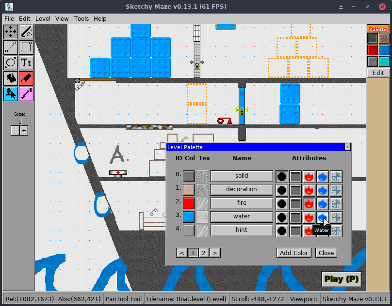
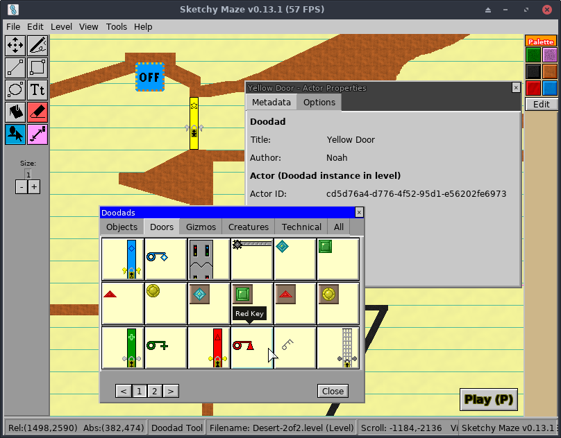

# Creating Custom Levels

One of the core gameplay features is the Level Editor which lets you draw your
own custom maps to play and share with others.

From the game's Main Menu, click on the "Create a Level" button to open the
level editor. To edit an existing custom level, click on the "Edit a Level"
button instead.

## Level Properties

When creating a new level, you first choose some settings for it. These are
described below:

### Page Type

This setting controls the size and boundaries of your level, and control the
appearance of the notebook paper background of your level.

* **Bounded** is the default. The camera won't scroll past the top-left corner
  of the page (0,0), and the level size is capped to 2550x3300, or the
  approximate size of an 11:9 standard sheet of notebook paper in pixels.
* **No Negative Space** is like Bounded, but the width and height of the level
  have no boundary. Levels can grow "infinitely" to the right and downward
  but no negative coordinates past the top or left edge.
* **Unbounded** allows for "infinite" sized maps that give unlimited room to
  grow your level. The wallpaper on this level type only uses the "tiling"
  pattern, so notebook-themed levels won't show the top/left decorations.

You can change these settings later if you change your mind.

### Wallpaper

The wallpaper affects the "theme" of your level. Project: Doodle is themed around
hand-drawn mazes on paper, so the built-in themes look like various kinds of
paper.

* **Notebook** looks like standard ruled notebook paper. It's a white paper with
  blue horizontal lines, a single red vertical line down the left, and a wide
  margin on the top and left edges.
* **Legal Pad** looks like ruled yellow legal pad. It's similar to Notebook but
  has yellow paper and a second vertical red line down the left.
* **Blueprint** is a dark blueprint paper background with a repeating grid pattern.
  Notably, the default Color Palette for this theme is different than normal:
  "solid" lines are white instead of black, to show up better against the dark
  background.

The decorations of the wallpaper vary based on the Page Type. For example, the
Notebook and Legal Pad have extra padding on the top of the page and red lines
going down just the left side, and the rest of the level uses the repeating blue
lines pattern. The page types and their effect on the wallpapers are:

* **Bounded** and **No Negative Space** will show the decorations for the top
  and left edges of the page, as these levels are bounded on their top/left
  corner.
* **Unbounded** levels only use the repeating tiled pattern across the entire
  level, because there is no top-left boundary to anchor those decorations to.

## Editor Interface

This is the level editor. You can click and drag on the blank page and begin
drawing a level. The toolbar down the left has various drawing tools: Pencil
(freehand), Line, Rectangle, Ellipse. The toolbar down the right is your level
palette. You can mouse-over most buttons and see an immediate tooltip appear
that describes what it is.

Quick 5-second overview of the editor interface:

* The top of the window has your [**Menu Bar**](#menu-bar), a common sight on desktop applications.
* The panel on the left side of the window is your **Tool Box**. Clicking these
  buttons activates a specific drawing tool or mode:
    * 
      **Pencil Tool** lets you click, drag, and draw pixels of your selected
      Palette color onto your level freehand. Shortcut key: `f`
    * 
      **Line Tool** lets you easily draw a straight line between two points. Click
      in your level where you want the first point to be, and drag your mouse to
      the second point. Release the mouse to commit the line to your drawing.
      Shortcut key: `l`
    * 
      **Rectangle Tool** lets you easily draw rectangles on your level. Shortcut: `r`
    * 
      **Ellipse Tool** lets you draw circles or elliptical shapes. Shortcut: `c`
    * 
      **Doodad Tool** lets you drag doodads such as buttons and doors onto your
      level. See the [Doodad Tool](#doodad-tool) below. Shortcut: `d`
    * 
      **Link Tool** lets you link doodads together so that they can interact off
      each other. For example, a Button connected to an Electric Door will cause
      the door to open and close when the button is pressed. See [Link Tool](#link-tool)
      below.
    * 
      **Eraser Tool** cleans up your mistakes. Click and drag over pixels you've
      drawn to delete the pixels from your level. Shortcut: `x`
* The **Size:** label on the left controls the brush size of your current drawing
  tool. This translates to the line thickness, or how big your pixels are when
  drawn into the level. Click the + and - buttons to increase or decrease the
  brush size, and draw thicker or thinner lines.
* The panel on the right side of the window is your **Palette** of colors to
  draw with. Mouse over a color to see its name and properties -- different
  colors may mean different things!
    * The **Edit** button will open the Palette Editor where you can change a
      color, rename it, and set its properties. See [Color Attributes](#color-attributes)

---

## Palette Editor

Clicking the "Tools" menu and "Edit Palette", or the Edit button on the
palette toolbar on the right side of the screen, will open the palette editor.

Levels are designed to have a limited color palette, and this is your selection
of colors for the level or doodad you're drawing. You can click on "Add Color"
to create more rows as needed.

### Color Attributes

The **Attributes** column toggles behaviors on or off for this color. In the default
color palette, black pixels make up your **solid** level geometry, red pixels are
**fire**, and blue pixels are **water**.

By default the color will be purely decorative, not physically colliding with the
player or affecting them in any way.

The attributes and their meanings are:

* **Solid**: the player character and other mobile doodads will collide against
  pixels drawn in this color. Useful for your level geometry.
* **Fire**: if the player touches pixels of this color, they die!
* **Water**: will act like water, currently it just draws the player blue.

### Changing Colors

Clicking on the colored square will prompt you to enter a new color in
hexadecimal notation, like `#FF00FF` for magenta
or `#0099FF` for light blue. Colors can
be entered in the following formats (the # prefix is actually optional):

* 3-digit hexadecimal: `#F0F` or `#09F`
* 6-digital hexadecimal: `#0099FF` or `#FC390E`
* 8-digit RGBA: `#0000FF99`

You can also set the color to be **semi-transparent** by providing an
additional two hex characters for its alpha channel:

> Pictured: I have set the "solid" color to #000000**33** giving it an alpha
> value -- making it semi transparent against the level wallpaper.

## Doodad Tool

When clicking on the  **Doodad Tool** or
pressing the `d` key, the Doodads window will appear in the level editor:

Doodads are objects you drag and drop into your level to add interactive elements
such as enemies and buttons. Mousing over a doodad will tell you its name, and
the pager buttons at the bottom can show more options.

Click and drag a doodad from the Doodads window onto your level to place it.

When the **Doodad Tool** is active on the left toolbar, when you mouse over an
existing doodad on your level, and orange box will appear around it. You may
click and drag to move this doodad somewhere else. Right-click it to remove it
from your level.

* Left click: move a doodad somewhere else on your level.
* Right click: remove the doodad from your level.

Doodads provide various useful features to your level:

* **Keys and Locked Doors** let you place collectible keys around the level which,
  when obtained, allow the player to permanently unlock doors of the same color
  and open new paths on the level. There are four pairs of keys and doors.
* **Buttons and Switches** let you open and close **Electric Doors** and trigger
  other devices to which they are linked.
* **Trapdoors** provide one-way gates; once the door has swung shut, it can not
  be entered from the wrong side!

To connect buttons to control doors, use the
 **Link Tool.**

## Link Tool

The  **Link Tool**
allows you to pair two doodads on your level together. This allows the doodads
to communicate events with each other, for example, so a button can open an
electric door when pressed.

This screenshot shows several buttons and switches that are linked to several
electric doors. With the Link Tool selected, mouse over a doodad on your level
and a magenta box appears around it. Click on it, and then click on the other
doodad to pair it to. A glowing magenta line will connect the two doodads
together from then on, showing their connection.

> **Note:** there seems to be no way to un-link two doodads once linked,
> deleting one from your level and placing a new one will break the links.

Linked doodads are able to send small messages to their linked partners when
events happen to _them_. For example, when the player character steps on a button
it sends a "power on" signal to the door it's connected to, and the door opens.
When the button is released, it sends a "power off" signal and the door closes.

See the [Doodads](../doodads.md) page for a description of the game's built-in
doodads and how they interact with each other.

## Menu Bar

While editing a level or doodad, a Menu Bar appears at the top of the screen.
Its options include:

* **File**
    * New level (Ctrl-N)
    * New doodad
    * Save (Ctrl-S)
    * Save as...
    * Open... (Ctrl-O)
    * Close level
    * Quit (Escape)
* **Edit**
    * Undo (Ctrl-Z)
    * Redo (Ctrl-Y)
* **Level**
    * Page settings (to change the level type or wallpaper)
    * Playtest (P)
* **Tools**
    * Debug overlay (F3)
    * Command shell (Enter)
    * Edit Palette
    * Doodads (d)
    * Pencil Tool (f)
    * Line Tool (L)
    * Rectangle Tool (r)
    * Ellipse Tool (c)
    * Eraser Tool (x)
    * Link Tool
* **Help**
    * User Manual (F1)
    * About

