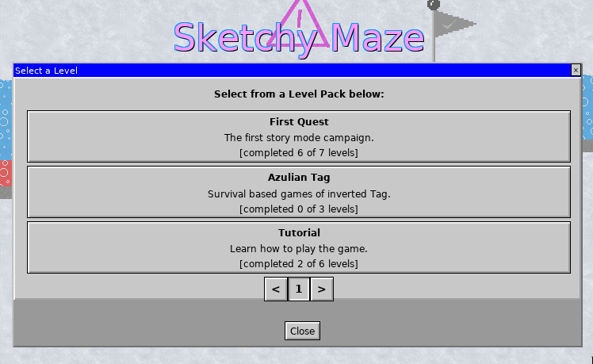

# Level Packs

Level Packs are collections of levels that are played in series. The game ships with a couple built-in level packs, but you can also create your own! Level Packs are selectable under the "Story Mode" option from the game's main menu.

While you can just create some [custom levels](index.md) one at a time and share them with your friends, with a Level Pack you can group a bunch of levels together that play one after another. Use them to tell a story or just group similar styles of level together.

## Features of Level Packs

Gameplay:

* The **Story Mode** screen presents a UI to browse level packs and select a level.
* Upon winning a level, a "Next Level" button appears that automatically advances to the next level of the pack. Pressing the Return key works too.
* A level pack may "lock" some of its levels until the player completes earlier levels. Each level completed will unlock the next. A level pack can define the number of unlocked levels to start with (or have them all unlocked).

Custom doodads:

* (In the future) A level pack can hold a folder of custom doodads that will be used by its levels. Instead of each level needing to [publish](publishing.md) (embed) its doodads individually, the level pack holds onto them so multiple levels can use them while saving on disk space!
* **Note:** [Free (shareware)](../register.md) versions of the game fully support custom Level Packs, but they don't support embedded custom doodads. Level Packs that use only the built-in doodads work perfectly, and in case you're using custom doodads, the player may manually install the custom doodads in their [profile directory](../profile-directory.md) and play it that way.

## Structure of a Level Pack

A levelpack is basically a ZIP file that contains levels, doodads, and an index.json that describes the level pack. To create a levelpack by hand, just create a correctly formatted ZIP file and rename the .zip extension to .levelpack. See [Creating a Level Pack](#creating-a-level-pack), below: the doodad tool makes this much easier!

The contents of a .levelpack ZIP archive are like follows:

    levels/
        First.level
        Second.level
        Third.level
    doodads/
        Example.doodad
    index.json

The `levels` folder holds your .level files and the `doodads` folder holds custom .doodad files. The doodads folder is optional and doesn't need to be included if there are no custom doodads.

The index.json file describes the levelpack. At time of writing it is structured like the following:

    {
        "Title": "Tutorial",
        "description": "Learn how to play the game.",
        "author": "Noah P",
        "created": "2021-12-27T04:45:29.186345525Z",
        "levels": [
            {
                "title": "Lesson 1: Controls",
                "author": "Noah P",
                "filename": "Tutorial 1.level"
            },
            {
                "title": "Lesson 2: Keys & Doors",
                "author": "Noah P",
                "filename": "Tutorial 2.level"
            },
            {
                "title": "Lesson 3: Gizmos and Doodads",
                "author": "Noah P",
                "filename": "Tutorial 3.level"
            }
        ],
        "freeLevels": 0
    }

The `levels` array describes the levels and their sort order. It is possible for .level files to exist in the levelpack which _are not_ described in the index.json; these levels will not be reachable in-game but in the future this may support hiding bonus levels linked to by other levels in the pack.

**TO DO:** the game does not yet do anything with the `doodads` folder. In the future, this folder will help a group of levels embed a custom doodad _once_ in the levelpack instead of each keeping a separate copy.

## Creating a Level Pack

The easiest way to create a .levelpack file is with the [doodad tool](../doodad-tool.md) that shipped with the game.

If you're using Windows or are not very experienced with the command line, you may want to create a folder and copy all your .level files from your [profile directory](../profile-directory.md) into it, as well as copy the `doodad.exe` or `doodad` program into the folder too and open that folder in your terminal window.

Run `./doodad levelpack create --help` to see the options:

    NAME:
       doodad levelpack create - create a new .levelpack file from source files

    USAGE:
       doodad levelpack create [command options] <output.levelpack> <input.level> [input.level...]

    OPTIONS:
       --title value, -t value        set a title for your levelpack, default will use the first level's title
       --author value, -a value       set an author for your levelpack, default will use the first level's author
       --description value, -d value  set a description for your levelpack
       --free value, -f value         set number of free levels (levels unlocked by default), 0 means all unlocked (default: 0)
       --doodads value, -D value      which doodads to embed: none, custom, all (default: "all")
       --help, -h                     show help (default: false)

The general format will be like:

> doodad levelpack create OUTPUT.levelpack INPUT.level

Write the name of your .levelpack OUTPUT file first, then give it the names of all your .level files.

You can use the additional command-line options (--title, --description, etc.) to set the metadata on your level pack. If you don't provide any, the Title will copy your first level's Title and the Author will copy your first level's Author (which is usually your username by default).

Examples:

    # Simple creation from a series of levels.
    # The levelpack Title will be the title from First.level
    # The levelpack Author will be the author from First.level
    doodad levelpack create OUTPUT.levelpack First.level Second.level Third.level

    # Provide metadata with the levelpack
    doodad levelpack create --title "My First Level Pack" \
      --author "Noah P" --description "Some of my first levels." \
      OUTPUT.levelpack First.level Second.level Third.level

    # Shorthand flags
    doodad levelpack create -t "My First Level Pack" -a "Noah P" -d "Some of my first levels." \
      OUTPUT.levelpack First.level Second.level Third.level

Place the resulting .levelpack file into your [profile directory](../profile-directory.md)'s "levelpacks" folder, and restart _Sketchy Maze_. Your levelpack should appear in the "Story Mode" menu!

## Open Levels in Editor

When playing a Story Mode level from a levelpack, the "Edit" button may be clicked to open the level in the Editor.

You are free to do this and learn from the levels you enjoy, and this won't harm the original levels at all! You can save a copy of the level, make changes to it and playtest your version of the level.

