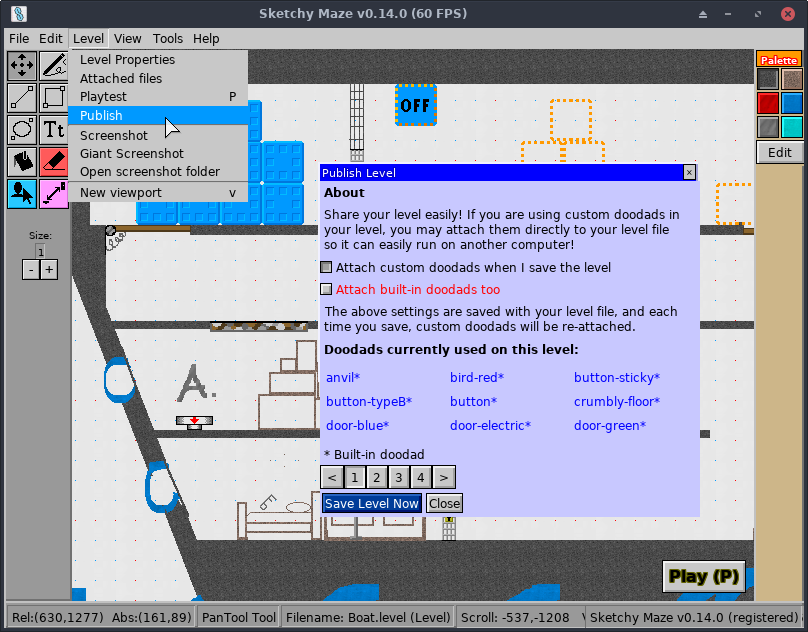

# Publishing Levels

Sketchy Maze is designed to be _very_ friendly to mods and custom user content,
and the **Publish Level** feature is an important part towards that goal.

When you have created your own level and you have added some
[custom doodads](../custom-doodads/index.md) to it, **publishing** your level
means that your custom doodads will _attach_ directly into the level file for
easy sharing with others: another player can download _just_ your `.level` file
and it will "just play" in their copy of the game, and they don't need to track
down all the same custom doodads you've used.

> <em>**Notice:** This feature is only available for full (registered) versions of the
> game. The free (shareware) version of </em>Sketchy Maze<em> supports custom levels
> and doodads, but you would need to copy the custom `.doodad` files to each
> computer your level will play on, otherwise the game won't be able to find
> them! Check [the website](https://www.sketchymaze.com/) for details how to acquire
> a full version of the game.</em>

## Publish a Level

When you are ready to share your level, click on the "File->Publish level" menu
option in the Level Editor.

The Publish window will show the list of named doodads which currently exist in
your level, designating which doodads are _custom_ and which were built-in with
the game (the built-in doodads are shown in blue text plus an asterisk* symbol).

The blue **Export Level** button will prompt for you to give a file name, and
the level will be written there _with_ all of its custom doodads embedded inside.

Optionally, you can choose to "Attach built-in doodads too" -- this will attach
copies of the built-in doodads to your level, too, which will override the game's
_actual_ built-in doodads. Doing this comes with some pros and cons:

* **Pro:** if future releases of _Sketchy Maze_ change the behavior or appearance
  of a built-in doodad, your custom level will still use the older version that
  it was published with.
* **Con:** if future updates to a built-in doodad have improved its appearance,
  added functionality or fixed bugs, the published level will not benefit from
  that update because it brought its own (older) version of the built-in doodad.

## Managing Attached Files

You can view and manage the files attached to a level by clicking on the
"Level -> Attached files" menu in the level editor:

This window lists the doodads, wallpapers or other custom assets which have been
attached directly _into_ the level file. A published level will have all of its
custom doodads attached (and possibly copies of the built-in doodads it used),
as well as the [custom wallpaper](custom-wallpaper.md) image (if any).

### Removing Attached Doodads

Attached doodads may be removed from the level **if** doing so will not break
the level. Generally, this means: if an instance of that doodad is still in
use _somewhere_ on your level, and removing the doodad from the Attached Files
would cause the level to be unable to locate that doodad, then removing it from
your level will not be permitted.

Doodads can be removed from the Attached Files list **if:**

* They are built-in doodads; removing them will cause the level to go back to
  using the built-in copies of these doodads instead.
* They are custom doodads **and** you have them in your [profile directory](../profile-directory.md):
  the level will start using the named doodad from your profile directory (similarly
  to how you designed the level in the first place, before publishing!)
* The doodad is no longer used in your level, e.g. you have removed every instance
  of the doodad from your level geometry.

### Removing Attached Wallpapers

Similarly: if the level is using a custom wallpaper image, you can not remove
the wallpaper from the Attached Files list while the level is still using it.

To remove the wallpaper image, you need to:

1. Go into the Page Settings (Level->Page settings menu) and select one of the
   built-in wallpaper images, such as "Notebook."
2. Then you can remove the custom wallpaper image from the Attached Files window.