# Built-in Doodads

Sketchy Maze comes with several built-in doodads that you can use in your levels. You may also [create your own](custom-doodads/index.md) custom doodads and program them to do whatever you want!

Doodads are available in the Level Editor by clicking on the  **Doodad Tool** and then dragging a doodad onto your level. See the [Doodad Tool](custom-levels/index.md#doodad-tool) for more information.

Some doodads have Options you can configure on a per-actor instance in your level. For example, Locked Doors can start unlocked by default, or Electric Doors may be opened by default when the level begins. These options will be described below on the doodads which have them.

**See also:** [Linked Doodads](linked-doodads.md) for how doodads interact when linked together in your levels.

*   [Objects](#objects)
    *   [Start Flag](#start-flag) - Spawn point of a level
    *   [Checkpoint Flag](#checkpoint-flag)
    *   [Exit Flag](#exit-flag) - Goal of a level
    *   [Anvil](#anvil)
    *   [Box](#box)
*   [Creatures](#creatures)
    *   [Boy](#boy) - The player character
    *   [Red Bird](#red-bird)
    *   [Blue Bird](#blue-bird) **NEW in v0.13.0**
    *   [Azulians](#azulians)
    *   [Thief](#thief)
    *   [Snake](#snake) - **NEW in v0.13.0**
    *   [Crusher](#crusher) - **NEW in v0.13.0**
*   [Doors & Trapdoors](#doors-trapdoors)
    *   [Colored Locked Doors & Keys](#colored-locked-doors-keys)
    *   [Small Key Doors](#small-key-doors)
    *   [Gems & Totems](#gems-totems) - **NEW in v0.13.0**
    *   [Warp Doors](#warp-doors)
    *   [Trapdoors](#trapdoors)
    *   [Electric Door](#electric-door)
    *   [Electric Trapdoor](#electric-trapdoor)
    *   [Crumbly Floor](#crumbly-floor)
*   [Gizmos](#gizmos)
    *   [Buttons](#buttons)
    *   [Sticky Button](#sticky-button)
    *   [Switches](#switches)
*   [Boolean State Doodads](#boolean-state-doodads)
    *   [State Button](#state-button)
    *   [State Blocks](#state-blocks)
    *   [Blue & Orange Warp Doors](#blue-orange-warp-doors)
*   [Technical Doodads](#technical-doodads)
    *   [Goal Region](#goal-region)
    *   [Checkpoint Region](#checkpoint-region)
    *   [Fire Region](#fire-region)
    *   [Look At Me](#look-at-me) **NEW in v0.13.1**
    *   [Power Source](#power-source)
    *   [Stall Player](#stall-player)
    *   [Invisible Warp Door](#invisible-warp-door) - **NEW in v0.10.1**
    *   [Reset Timer](#reset-timer) **NEW in v0.12.0**

* * *

## Objects

### Start Flag

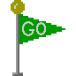

The **Start Flag** sets the player spawn point in your level. There should be only one start flag per level.

Multiple Start Flags in one level is considered to be an error; a warning is flashed on-screen and the player will spawn at the "first" start flag it found.

A level without a Start Flag will spawn the player at the 0,0 coordinate at the top-left corner of the level, and flash an error about the missing Start Flag.

If the Start Flag is [linked](linked-doodads.md#start-flag) to another doodad in your level, then that doodad will be used for the player character. For example, linking a Start Flag to a Thief will use the Thief as the player character for that level instead of the default character, [Boy](#boy).

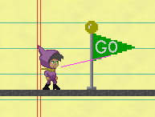

### Checkpoint Flag

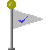

The **Checkpoint Flag** records the player's position in the level each time they reach a checkpoint. Should they die during the level, the option to "Retry from checkpoint" will teleport the player back to that location and continue gameplay without resetting the level -- so you keep any keys you have, unlocked doors remain unlocked, etc.

The default checkpoint location is at the Start Flag, and crossing Checkpoint Flags updates it to the last flag touched. When a second checkpoint is touched, the previous checkpoint flags are reset and the player's spawn point is the checkpoint they most recently touched.

**New in v0.11.0:** if you link a doodad to a Checkpoint Flag, the player character will be replaced with that doodad when the flag is activated!

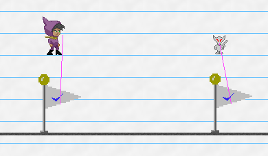

### Exit Flag

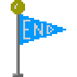

The **Exit Flag** sets a goal point for the level. The player must touch this flag to win the level.

### Anvil

The **Anvil** is a "harmless" object that becomes dangerous when it is falling.

It has no collision and is affected by gravity; when falling, it is dangerous to any mobile doodad that it encounters, including the player character. Being hit by it will fail the level with "Watch out for falling anvils!" and you can retry from your last checkpoint. It destroys other mobile doodads that it lands on, removing them from the level.

If it receives a **power** signal (from a [linked](linked-doodads.md#buttons) Button or Switch), the Anvil will reset to its original location on the level, making "reset buttons" possible for puzzle levels.

**New in v0.11.0:** the Anvil is invulnerable. This means that if the player character _is_ an Anvil, it can jump on and crush other enemies but can't be damaged by enemies or by fire pixels. Anvils also will not destroy invulnerable characters such as other Anvils.

### Box

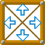

The **Box** is a pushable object. If the player or another mobile doodad touches the box from the side, the box will move at a fixed speed. It can be pushed up and down slopes and it is affected by gravity.

The box is taller than [Boy](#boy) and so can make a useful platform to jump on top of to reach a higher ledge.

Boxes can be pushed by enemies too, but it gets dicey with multiple enemies pushing simultaneously. Boxes can be stacked on top of each other, but sometimes Boy will get "stuck" standing on top of the pile. If this happens, use the [cheat code](hacking.md#cheat-codes) `ghost mode` to get yourself unstuck.

If it receives a **power** signal (from a [linked](linked-doodads.md#buttons) Button or Switch), the Box will reset to its original location on the level, making "reset buttons" possible for puzzle levels.

* * *

## Creatures

### Boy

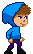

The **Boy** is the default player character.

If he touches a "fire" pixel, he dies! You get a message like "Watch out for fire!" and it doesn't even have to say "fire" - it'll use the color's name.

If he touches water he'll turn blue. Swimming physics aren't hooked up yet!

The player character can be substituted on a custom map by linking another doodad to the Start Flag.

### Red Bird

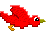

The **Bird** is a simple creature which flies left and right across your level, changing direction when it encounters an obstacle.

The Bird is hostile towards players who are affected by gravity, and will dive bomb if they see a shot they can take (if you are spotted 45 degrees below the direction the Bird is flying). The Bird is dangerous while it is dive bombing. If it misses and hits the ground, it will fly back up to its original elevation.

The Bird can not pick up any items (such as keys) unless it is controlled by the player character. You can play as the Bird in a custom map by linking it to the Start Flag or a Checkpoint Flag. When under the player's control, you can dive by moving diagonally downwards and you can kill mobile doodads (such as the Azulians) by diving into them. Watch out! They can get you too if they touch you while you're _not_ diving!

The Bird's behavior can vary according to the level's Difficulty rule:

*   Peaceful: the Bird will not attack any player and simply flies back and forth.

### Blue Bird

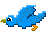

The Blue bird flies in a sine wave pattern while idle and, like the Red Bird, will dive and attack player characters who can't fly, but with a larger aggro radius than the red bird.

### Azulians

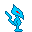 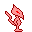 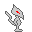

The **Azulians** are hostile mobs and come in three varieties. The Blue Azulian walks the slowest and has the shortest jump height and on the other end of the spectrum, the White Azulian is the fastest and can jump the highest.

When the Azulians notice the player character they will begin to chase after them, and you'll fail the level if they get you! Azulians are friendly to other Azulians, and they don't attack the Thief either.

When not chasing after the player, the Azulians simply walk back and forth and change direction when they encounter an obstacle. They can pick up keys, unlock doors, and interact with buttons and switches that they walk onto.

You can play as the Azulians in your custom levels by linking them to the Start Flag or to a Checkpoint Flag.

> Fun Trivia: the Red Azulian was the game's first test mobile character, and the Blue Azulian was originally a placeholder for the player character in early builds of the game.

The Azulian's behavior can very depending on the level's Difficulty rule:

*   Peaceful: Azulians are passive to all players and simply walk back and forth.
*   Hard: Azulians have an infinite aggro radius and will move towards the player character no matter how far away. They are hostile to _all_ player creatures, even if you are playing as an Azulian or a Thief.

### Thief

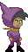

The **Thief** is a mobile character which can steal items from other doodads, including the player character.

The Thief's A.I. is to walk right and left, she can pick up items, unlock doors, and activate most devices that it walks onto. When she encounters another doodad (including the player), the Thief will **steal** any items they are carrying:

*   For items which have no quantity, such as the Blue Key, the Thief will only steal it if she does not already have one, letting the player keep the key.
*   Items with quantity are always stolen: the Thief will steal all your small keys.
*   The A.I. Thief does **not** steal from other A.I. Thieves.

The player can play **as** the Thief by using the Link Tool and connecting the Start Flag to a Thief. When controlled by the player character, the Thief has special abilities compared to most other characters:

*   You can steal items from other characters. When you contact another character such as the Azulians, if they are holding any items, you'll automatically steal them in the same way the Thief usually steals from you.
*   The player character is immune to Thieves which will not steal from Thieves.
*   The player character _can_, though, pilfer items that the other Thieves have collected.

### Snake

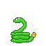

The **Snake** is a stationary enemy that always turns to face the player character. If you are near the snake and you jump, the Snake will also jump, hoping to catch you mid-air when you try and jump over!

If you are playing **as** the snake, you stay in your idle animation while moving laterally and play the jump animation when you jump. Snakes are friendly to other Snakes but will still jump along with you.

### Crusher

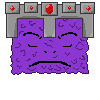

The **Crusher** is a trap that falls from above. It sleeps soundly until the player character approaches, and it will start peeking at you with one eye open. If you get below the Crusher, it will attempt to drop on top of you! It might also crush other mobile creatures who happen to get in the way.

If you play **as** the Crusher you can travel through the air freely with antigravity enabled. The Crusher will peek in the direction you're moving (right or left, or both!) and puts on the angry drop face if you are moving downwards.

* * *

## Doors & Trapdoors

### Colored Locked Doors & Keys

 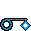

There are four pairs of **Colored Locked Doors and Keys** you can use on your level.

Colored doors are locked and behave as a solid wall until the player or another mobile doodad "picks up" the Key of the same color. The doors may then be permanently unlocked if the player walks into them while holding the key.

The **Colored Keys** are not consumed when used; with one key the player can unlock many doors of the same color unless they lose the key. Keys may be stolen by the [Thief](#thief) or by using the "drop all items" [cheat code](hacking.md#cheat-codes).

A locked door has a golden padlock over its sprite; after being unlocked, the padlock is missing even while the door is closed. Should the player lose the keys later, previously opened doors will remain unlocked but the player will need to find another key to open more doors.

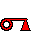 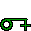  

Each key/door pair also has a distinct shape for color-impaired players:

*   **Red Key** (triangle)
*   **Green Key** (cross)
*   **Yellow Key** (star)
*   **Blue Key** (diamond)

**Actor Options:**

* `unlocked` - boolean - if this option is checked, the door will be "unlocked" by default when the level begins, not requiring a key to open.
* Keys: `gravity` - boolean - if this option is checked, the keys will be subject to gravity and be considered a 'mobile' doodad, able to activate buttons or trapdoors that it falls on.

### Small Key Doors

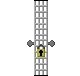 

**Small Key Doors** are doors which consume the **Small Key** when unlocked. The player or other mobile doodad may carry several Small Keys and they can only unlock as many Small Key Doors as the number of keys they hold.

The Small Key Door is permanently unlocked after unlocking it once. A golden padlock appears on the door when it's locked, which disappears after unlocking.

**Actor Options:**

* `unlocked` - boolean - if this option is checked, the door will be "unlocked" by default when the level begins, not requiring a key to open.
* Keys: `gravity` - boolean - if this option is checked, the keys will be subject to gravity and be considered a 'mobile' doodad, able to activate buttons or trapdoors that it falls on.

### Gems & Totems

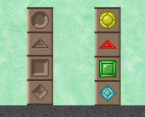

      

Gemstones are collectible items which slot into Totems blocks. The player can carry many of the same gemstone at a time and a gemstone is consumed when its matching totem is activated.

The Totem emits a `power(true)` signal to linked doodads when it receives its gem stone. However, if the Totem is linked with _other_ Totems, it will not emit a power signal until _all_ of its linked Totems have their gem stones.

To set up a multi-totem lock that opens an Electric Door only when all the gems have been collected:

*   Only one totem of the bunch needs to link to the Electric Door.
*   That same totem also needs to link to each of the other totems.

You do not need to link every Totem to every Totem. Pick just one of your totems and link it to the Electric Door _and_ to all of the other totems, and it won't emit a power signal until itself and all its linked totems have gems.

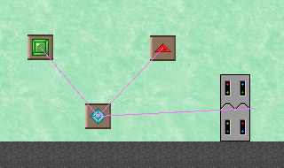

**Actor Options:**

* Totems: `has gemstone` - boolean - if this option is checked, the totem will already have its gemstone. This is for cosmetic purposes only -- do not Link the totem to anything, as it will not emit a power signal or inform linked totems that it has a gemstone.
* Gemstones: `gravity` - boolean - this is on by default and gemstones are affected by gravity. Turn it off to remove gravity, and they will behave as keys do by default.

### Warp Doors

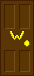

The **Warp Door** allows the player character to fast travel between two remote locations within the same level. The door is brown in color with a yellow "W" symbol.

To connect the doors together, drag two doors into your level and then use the **Link Tool** to connect them. During gameplay, walk the player character to one of the doors and press the Space Key to open it. The door will swing open and shut and the player character exits from the other door.

If a Warp Door is not linked to another door, a message will display indicating that the door is "locked" and it can not be entered by the player.

**New in v0.10.1:** a Warp Door may only be opened by the player while the player is touching the ground (unless under the effects of antigravity, or while playing as the Bird). A door that is sufficiently up in the air requiring the player to jump or to fall past it can _not_ be opened by the player while in mid-air.

**Actor Options:**

* `locked (exit only)` - boolean - if this option is checked, the Warp Door can not be entered by the player; it will behave as a locked door, similarly to a door which has no linked exit. The door may still be exited from if another linked Warp Door sends the player there. You can make one-way Warp Doors by using this option.

**See also:** the [Blue & Orange Warp Doors](#blue-orange-warp-doors) tied to the [State Blocks](#state-blocks).

### Trapdoors

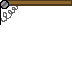

A **Trapdoor** is a one-way passage. If the player or other mobile doodad touches the door from the "correct" side, the door will swing open. After the mobile doodad has passed, the door will swing shut again.

When the door is shut, you can not open it from the "wrong" side and it behaves as a solid wall. If the door is open you may run in from the wrong side.

Trapdoors come in four variants: downward-facing (default), rightward, leftward and upwards.

### Electric Door

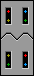

The sci-fi **Electric Door** can only be opened when it receives a "power" signal from a linked button or switch. See [Linked Doodads](custom-levels/index.md#link-tool).

When the door receives a "power: on" signal it will open and allow passage to the player or other mobile doodads. When it receives a "power: off" signal it will close.

**Actor Options:**

* `opened` - boolean - if this option is checked, the Electric Door will be opened (powered) by default when the level begins. A switch may toggle it closed, or if it receives and then loses power, it will close as normal.

### Electric Trapdoor

The **Electric Trapdoor** requires a power source to open it.

If it receives a power signal from a linked Button or Switch, it will open. When it loses power, it will close. Switches will always toggle its state regardless of "power" status.

**Actor Options:**

* `opened` - boolean - if this option is checked, the Electric Trapdoor will be opened (powered) by default when the level begins. A switch may toggle it closed, or if it receives and then loses power, it will close as normal.

### Crumbly Floor

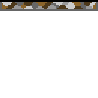

The **Crumbly Floor** behaves as a solid ceiling when hit from below, and a solid floor when walked on from above, but watch out! The floor will shake and collapse after a moment beneath your feet.

The floor will respawn after a while and forbids passage from the underside of the doodad.

* * *

## Gizmos

The gizmo doodads work best when **Linked** to other doodads in your level. For example, a Button linked to an Electric Door will cause the door to open whenever the button is pressed.

**See also:** [Link Tool](custom-levels/index.md#link-tool)

### Buttons

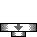 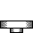

**Buttons** will emit a `power: on` signal to all doodads that they are [linked to](custom-levels/index.md#link-tool) when the button is pressed by the player or another mobile doodad.

When the button stops being pressed, it will emit a `power: off` signal to all connected doodads, which will generally close electric doors.

Buttons come in two varieties which are cosmetic only:

*   **Button:** a button with a grey arrow that pops back up when pressed.
*   **Button Type B:** a variation without the grey arrow but behaves the same.

### Sticky Button

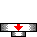

The **Sticky Button** is a variant of the Button but with a red arrow on its side.

When the Sticky Button is pressed, it will emit a `power: on` signal and it will **remain pressed** forever -- unless the button itself receives a `power: on` signal from another linked doodad, then it will pop back up and can be pressed again.

### Switches

 

**Switches** will emit a `power: on` signal to any [linked](custom-levels/index.md#link-tool) doodads when touched by the player or other mobile doodad, and then a `power: off` signal when touched again.

Switches come in a few different styles (all cosmetic in nature and behave the same way):

*   On/Off "background" wall switch that faces the screen.
*   Side-profile switches to attach to the side of a wall (left and right).
*   Side-profile floor switch.

* * *

## Boolean State Doodads

The **Boolean State Doodads** are a series of doodads which have a mutually exclusive state from one another, with their state toggled by the "ON/OFF" State Button.

### State Button

 

The **State Button** globally toggles the boolean state for all doodads in the level which are sensitive to the state.

The player character must jump into the ON/OFF block from below and hit it with their head. From above, the ON/OFF block acts like a solid floor that the player or other mobile doodads can stand on top of.

In the future it will be possible to bonk the ON/OFF block from the sides or top with enough force, but currently only hitting it from the bottom will flip its state.

*   When the button is **OFF**, all **blue** state doodads are active. This is the default state.
*   When the button is **ON**, all **orange** state doodads are active.

### State Blocks

 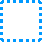

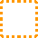 

**State Blocks** are blue and orange squares that keep opposite state from one another. In one state the block is solid, in another it is passable.

The ON/OFF block will toggle all state blocks on the level to their opposite setting whenever it's touched by the player or other mobile doodad.

### Blue & Orange Warp Doors

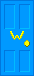 

 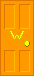

The **Blue & Orange Warp Doors** are variants of the [Warp Door](#warp-doors) that are sensitive to the ON/OFF State Blocks. These doors can only be opened while the door is in the "ON" (active) state -- when "OFF" (drawn as a hollow dotted outline) the door can not be opened by the player. However, a player may still **exit** from a de-activated door.

The **Blue Warp Door** is active at the same time as the **Blue State Blocks**, and vice versa for the **Orange Warp Door.**

**New in v0.10.1:** a Warp Door may only be opened by the player while the player is touching the ground (unless under the effects of antigravity, or while playing as the Bird). A door that is sufficiently up in the air requiring the player to jump or to fall past it can _not_ be opened by the player while in mid-air.

**Actor Options:**

* `locked (exit only)` - boolean - if this option is checked, the Warp Door can not be entered by the player; it will behave as a locked door, similarly to a door which has no linked exit. The door may still be exited from if another linked Warp Door sends the player there. You can make one-way Warp Doors by using this option.

* * *

## Technical Doodads

"Technical" doodads tend to turn invisible during gameplay and have some useful interactions for certain situations.

### Goal Region

This doodad acts like an invisible Exit Flag, winning the level if touched by a player character.

### Checkpoint Region

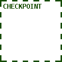

This doodad acts like an invisible Checkpoint Flag, recording the player's progress in a level.

### Fire Region

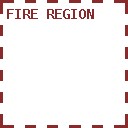

This doodad will trigger the fail condition if touched by the player.

**Actor Options:**

* `name` - string - default is "fire", you may give the Fire Region a custom name to make it better imitate fire pixels. When touched, the fail message will be "Watch out for (name)!"

### Look At Me

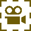

The "Look At Me" doodad will attract the camera's attention when it receives a power signal from a linked button or switch.

An example use case is this: you have a Button that opens an Electric Door far across the level. When the button is pressed, you want the camera to scroll over to the Electric Door that it opened, so that the player can tell what has happened.

To do this, you would drag a "Look At Me" near the Electric Door and, with the Link Tool, connect the button to both the Electric Door and the "Look At Me." When the button is activated, and the two doodads receive power, the camera will scroll to where the Look At Me was placed.

If the player character inputs any directional controls, the camera will scroll back to follow the player again.

### Power Source

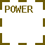

On level start, this doodad emits a `power(true)` signal to all linked doodads. Connect it to an Electric Door, for example, and the door will open immediately when the level begins.

### Stall Player

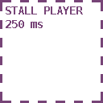

This doodad will freeze the player character for 250ms, one time. It is useful if you need to slow down the player to get some timing in your level to work out.

If this doodad receives power from a linked button, it will reset the trap, and will freeze the player again for 250ms should they make contact with the doodad again.

### Invisible Warp Door

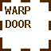

This doodad acts just like the [Warp Doors](#warp-doors) but is invisible. Pressing the 'Use' key while grounded will activate the door and send you to the door it is linked to (if one exists).

**Actor Options:**

* `locked (exit only)` - boolean - if this option is checked, the Warp Door can not be entered by the player; it will behave as a locked door, similarly to a door which has no linked exit. The door may still be exited from if another linked Warp Door sends the player there. You can make one-way Warp Doors by using this option.

### Reset Timer

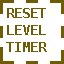

This doodad will reset the level timer to zero, one time, when touched by the player. An example where it is used is on the Azulian Tag Tutorial level: the player could spend any amount of time reading the tutorial instructions, and Azulian Tag levels are rewarded for how long the player survives before dying, so they could artificially run up the clock before the game even begins!

The Reset Timer only runs one time when the player first touches it. If the doodad receives a power signal from a linked button or similar, it will 'reset' and is able to again reset the level timer one time the next time the player touches it.
