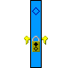
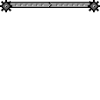

# Built-in Doodads

Sketchy Maze comes with several built-in doodads that you can use in your
levels. You may also [create your own](custom-doodads/index.md) custom doodads
and program them to do whatever you want!

Doodads are available in the Level Editor by clicking on the
 **Doodad Tool**
and then dragging a doodad onto your level. See the [Doodad Tool](custom-levels/index.md#doodad-tool)
for more information.

**See also:** [Linked Doodads](linked-doodads.md) for how doodads interact when
linked together in your levels.

* [Objects](#objects)
    * [Start Flag](#start-flag) - Spawn point of a level
    * [Checkpoint Flag](#checkpoint-flag) - **NEW in v0.8.0**
    * [Exit Flag](#exit-flag) - Goal of a level
    * [Anvil](#anvil) - **NEW in v0.8.0**
    * [Box](#box)
* [Creatures](#creatures)
    * [Boy](#boy) - The player character
    * [Red Bird](#red-bird)
    * [Azulians](#azulians)
    * [Thief](#thief) - **NEW in v0.8.0**
* [Doors & Trapdoors](#doors-trapdoors)
    * [Colored Locked Doors & Keys](#colored-locked-doors-keys)
    * [Small Key Doors](#small-key-doors)
    * [Warp Doors](#warp-doors)
    * [Trapdoors](#trapdoors)
    * [Electric Door](#electric-door)
    * [Electric Trapdoor](#electric-trapdoor)
    * [Crumbly Floor](#crumbly-floor)
* [Objects](#objects)
    * [Box](#box)
* [Gizmos](#gizmos)
    * [Buttons](#buttons)
    * [Sticky Button](#sticky-button)
    * [Switches](#switches)
* [Boolean State Doodads](#boolean-state-doodads)
    * [State Button](#state-button)
    * [State Blocks](#state-blocks)
    * [Blue & Orange Warp Doors](#blue-orange-warp-doors)

---

## Objects

### Start Flag

The **Start Flag** sets the player spawn point in your level. There should be
only one start flag per level.

Multiple Start Flags in one level is considered to be an error; a warning is
flashed on-screen and the player will spawn at the "first" start flag it found.

A level without a Start Flag will spawn the player at the 0,0 coordinate at
the top-left corner of the level, and flash an error about the missing Start
Flag.

If the Start Flag is [linked](linked-doodads.md#start-flag) to another doodad
in your level, then that doodad will be used for the player character. For example,
linking a Start Flag to a Thief will use the Thief as the player character
for that level instead of the default character, [Boy](#boy).

### Checkpoint Flag

The **Checkpoint Flag** records the player's position in the level each time
he reaches a checkpoint. Should they die during the level, the option to
"Retry from checkpoint" will teleport the player back to that location and
continue gameplay without resetting the level -- so you keep any keys you
have, unlocked doors remain unlocked, etc.

The default checkpoint location is at the Start Flag, and crossing Checkpoint
Flags updates it to the last flag touched. When a second checkpoint is touched,
the previous checkpoint flags are reset and the player's spawn point is the
checkpoint they most recently touched.

### Exit Flag

The **Exit Flag** sets a goal point for the level. The player must touch this
flag to win the level.

### Anvil

The **Anvil** is a "harmless" object that becomes dangerous when it is falling.

It has no collision and is affected by gravity; when falling, it is dangerous
to any **mobile** doodad that it encounters, including the player character.
Being hit by it will fail the level with "Watch out for falling anvils!" and
you can retry from your last checkpoint. It destroys other mobile doodads that
it lands on, removing them from the level.

If it receives a **power** signal (from a [linked](linked-doodads.md#buttons)
Button or Switch), the Anvil will reset to its original location on the level,
making "reset buttons" possible for puzzle levels.

### Box

The **Box** is a pushable object. If the player or another mobile doodad touches
the box from the side, the box will move at a fixed speed. It can be pushed up
and down slopes and it is affected by gravity.

The box is taller than [Boy](#boy) and so can make a useful platform to jump on top of
to reach a higher ledge.

Boxes can be pushed by enemies too, but it gets dicey with multiple enemies
pushing simultaneously. Boxes can be stacked on top of each other, but sometimes
Boy will get "stuck" standing on top of the pile. If this happens, use the
[cheat code](hacking.md#cheat-codes) `ghost mode` to get yourself unstuck.

**New in v0.8.0:**
If it receives a **power** signal (from a [linked](linked-doodads.md#buttons)
Button or Switch), the Anvil will reset to its original location on the level,
making "reset buttons" possible for puzzle levels.

---

# Creatures

### Boy

**Boy** is the player character.

If he touches a "fire" pixel, he dies! You get a message like "Watch out for fire!"
and it doesn't even have to say "fire" - it'll use the color's name.

If he touches water he'll turn blue. Swimming physics aren't hooked up yet!

### Red Bird

The **Bird** is a simple creature which flies left and right across your level,
changing direction when it encounters an obstacle.

The bird has solid collision on its top side, so the player can ride on it
across the level. It's very slippery, though!

In the future, the bird will dive-bomb the player character in a diagonal
trajectory when it sees a shot it can take. This will harm the player if the
bird hits. If the bird hits the player, or misses and touches the ground, it
will fly back up to its original altitude and continue its A.I. program of
flying back and forth and searching for the player. It will also be easier to
ride more reliably.

Currently, however, the bird is harmless and does not dive bomb the player.

**New in v0.8.0:** the Bird no longer can pick up items such as keys, unless
controlled by the player character.

### Azulians

The **Red Azulian** was the first test mobile character, and the
**Blue Azulian** was originally the player character in very early builds of
the game.

The Azulians' A.I., when placed in your level, is that they walk right and
left across the ground, changing directions when hitting an obstacle. They
can pick up keys, unlock doors, and interact with buttons and switches that
they walk onto - basically all the capabilities as the player character.
The blue Azulian walks half as fast as the red one.

You can play as them in your custom levels by linking a Start Flag to
the Azulian.

### Thief

The **Thief** is a mobile character which can steal items from other doodads,
including the player character.

The Thief's A.I. is to walk right and left, she can pick up items, unlock doors,
and activate most devices that it walks onto. When she encounters another
doodad (including the player), the Thief will **steal** any items they are
carrying:

* For items which have no quantity, such as the Blue Key, the Thief will only
  steal it if she does not already have one, letting the player keep the
  key.
* Items with quantity are always stolen: the Thief will steal all your small
  keys.
* The A.I. Thief does **not** steal from other A.I. Thieves.

The player can play **as** the Thief by using the Link Tool and connecting
the Start Flag to a Thief. When controlled by the player character, the Thief
has special abilities compared to most other characters:

* You can steal items from other characters. When you contact another character
  such as the Azulians, if they are holding any items, you'll automatically
  steal them in the same way the Thief usually steals from you.
* The player character is immune to Thieves which will not steal from Thieves.
* The player character _can_, though, pilfer items that the other Thieves have
  collected.

---

## Doors & Trapdoors

### Colored Locked Doors & Keys

 

There are four pairs of **Colored Locked Doors and Keys** you can use on your level.

Colored doors are locked and behave as a solid wall until the player or another
mobile doodad "picks up" the Key of the same color. The doors may then be
permanently unlocked if the player walks into them while holding the key.

The **Colored Keys** are not consumed when used; with one key the player can
unlock many doors of the same color unless they lose the key. Currently there is
no method to lose keys except for the "drop all items" [cheat code](hacking.md#cheat-codes).

A locked door has a golden padlock over its sprite; after being unlocked, the
padlock is missing even while the door is closed. Should the player lose the keys
later, previously opened doors will remain unlocked but the player will need to
find another key to open more doors.

   

Each key/door pair also has a distinct shape for color-impaired players:

* **Red Key** (triangle)
* **Green Key** (cross)
* **Yellow Key** (star)
* **Blue Key** (diamond)

### Small Key Doors

 

**Small Key Doors** are doors which consume the **Small Key** when unlocked. The
player or other mobile doodad may carry several Small Keys and they can only
unlock as many Small Key Doors as the number of keys they hold.

The Small Key Door is permanently unlocked after unlocking it once. A golden
padlock appears on the door when it's locked, which disappears after unlocking.

### Warp Doors

The **Warp Door** allows the player character to fast travel between two remote
locations within the same level. The door is brown in color with a yellow "W"
symbol.

To connect the doors together, drag two doors into your level and then use the
**Link Tool** to connect them. During gameplay, walk the player character to one
of the doors and press the Space Key to open it. The door will swing open and
shut and the player character exits from the other door.

If a Warp Door is not linked to another door, a message will display indicating
that the door is "locked" and it can not be entered by the player.

**See also:** the [Blue & Orange Warp Doors](#blue-orange-warp-doors) tied to the
[State Blocks](#state-blocks).

### Trapdoors

A **Trapdoor** is a one-way passage. If the player or other mobile doodad touches
the door from the "correct" side, the door will swing open. After the mobile
doodad has passed, the door will swing shut again.

When the door is shut, you can not open it from the "wrong" side and it behaves
as a solid wall. If the door is open you may run in from the wrong side.

Trapdoors come in four variants: downward-facing (default), rightward, leftward
and upwards.

### Electric Door

The sci-fi **Electric Door** can only be opened when it receives a "power" signal
from a linked button or switch. See [Linked Doodads](custom-levels/index.md#link-tool).

When the door receives a "power: on" signal it will open and allow passage to
the player or other mobile doodads. When it receives a "power: off" signal it
will close.

### Electric Trapdoor

The **Electric Trapdoor** requires a power source to open it.

If it receives a power signal from a linked Button or Switch, it will open.
When it loses power, it will close. Switches will always toggle its state
regardless of "power" status.

### Crumbly Floor

The **Crumbly Floor** behaves as a solid ceiling when hit from below, and a
solid floor when walked on from above, but watch out! The floor will shake
and collapse after a moment beneath your feet.

The floor will respawn after a while and forbids passage from the underside
of the doodad.

---

## Gizmos

The gizmo doodads work best when **Linked** to other doodads in your level. For
example, a Button linked to an Electric Door will cause the door to open whenever
the button is pressed.

**See also:** [Link Tool](custom-levels/index.md#link-tool)

### Buttons

 

**Buttons** will emit a `power: on` signal to all doodads that they are
[linked to](custom-levels/index.md#link-tool) when the button is pressed by the
player or another mobile doodad.

When the button stops being pressed, it will emit a `power: off` signal to
all connected doodads, which will generally close electric doors.

Buttons come in two varieties which are cosmetic only:

* **Button:** a button with a grey arrow that pops back up when pressed.
* **Button Type B:** a variation without the grey arrow but behaves the same.

### Sticky Button

The **Sticky Button** is a variant of the Button but with a red arrow on its side.

When the Sticky Button is pressed, it will emit a `power: on` signal and it will
**remain pressed** forever -- unless the button itself receives a `power: on`
signal from another linked doodad, then it will pop back up and can be pressed
again.

### Switches

 

**Switches** will emit a `power: on` signal to any [linked](custom-levels/index.md#link-tool)
doodads when touched by the player or other mobile doodad, and then a `power: off`
signal when touched again.

Switches come in a few different styles (all cosmetic in nature and behave the
same way):

* On/Off "background" wall switch that faces the screen.
* Side-profile switches to attach to the side of a wall (left and right).
* Side-profile floor switch.

---

## Boolean State Doodads

The **Boolean State Doodads** are a series of doodads which have a mutually
exclusive state from one another, with their state toggled by the "ON/OFF"
State Button.

### State Button

 

The **State Button** globally toggles the boolean state for all doodads in the
level which are sensitive to the state.

The player character must jump into the ON/OFF block from below and hit it with
their head. From above, the ON/OFF block acts like a solid floor that the player
or other mobile doodads can stand on top of.

In the future it will be possible to bonk the ON/OFF block from the sides or
top with enough force, but currently only hitting it from the bottom will flip
its state.

* When the button is **OFF**, all **blue** state doodads are active. This is the default state.
* When the button is **ON**, all **orange** state doodads are active.

### State Blocks

 

 

**State Blocks** are blue and orange squares that keep opposite state from one
another. In one state the block is solid, in another it is passable.

The ON/OFF block will toggle all state blocks on the level to their opposite
setting whenever it's touched by the player or other mobile doodad.

### Blue & Orange Warp Doors

 

 

The **Blue & Orange Warp Doors** are variants of the [Warp Door](#warp-doors) that
are sensitive to the ON/OFF State Blocks. These doors can only be opened while the
door is in the "ON" (active) state -- when "OFF" (drawn as a hollow dotted outline)
the door can not be opened by the player. However, a player may still **exit** from
a de-activated door.

The **Blue Warp Door** is active at the same time as the **Blue State Blocks**,
and vice versa for the **Orange Warp Door.**
