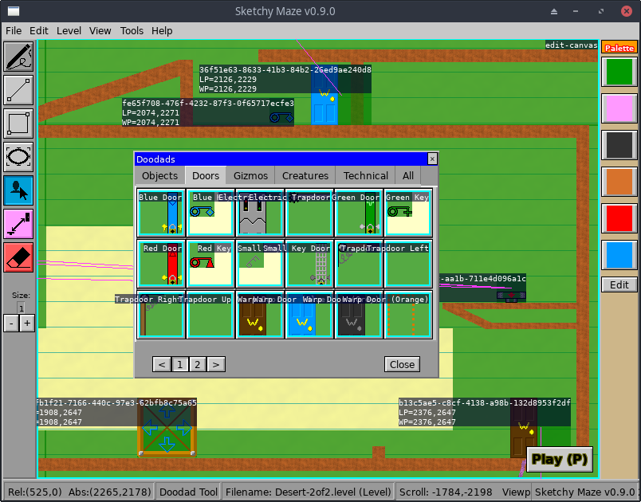

# Hacking

This page discusses some advanced features of the game and targets a more technical audience.

I've always loved it when developers keep debugging features in their released games, and playing around with those and figuring out what makes the game tick. I purposely left some debug features in the game that you can play around with.

## Debug Features

Pressing `F3` within the game will draw the **Debug Overlay** on top of the screen, displaying details such as the game's frames per second and some contextual details like: what is the world index of the pixel below your mouse cursor, while you're editing a level? (Details such as this are also seen in the status bar at the bottom of the editor screen).

The game can be launched with certain **Environment Variables** set to add some additional debug visuals to the game. Examples:

```bash
# Draw a semi-transparent yellow background over all level chunks
$ DEBUG_CHUNK_COLOR=FFFF0066 ./doodle

# Set a window size for the application
# (equivalent to: doodle --window 1024x768)
$ DOODLE_W=1024 DOODLE_H=768 ./doodle

# Turn on lots of fun debug features.
$ DEBUG_CANVAS_LABEL=1 DEBUG_CHUNK_COLOR=FFFF00AA \
  DEBUG_CANVAS_BORDER=FF0 ./doodle
```




Supported variables include:

*   `DOODLE_W` and `DOODLE_H` set the width and height of the application window. Equivalent to the `--window` command-line option.
*   `D_SCROLL_SPEED` (int): tune the canvas scrolling speed. Default might be around 8 or so.
*   `D_DOODAD_SIZE` (int): default size for newly created doodads
*   `D_SHELL_BG` (color): set the background color of the developer console
*   `D_SHELL_FG` (color): text color for the developer console
*   `D_SHELL_PC` (color): color for the shell prompt text
*   `D_SHELL_LN` (int): set the number of lines of output history the console will show. This dictates how 'tall' it rises from the bottom of the screen. Large values will cover the entire screen with console whenever the shell is open.
*   `D_SHELL_FS` (int): set the font size for the developer shell. Default is about 16. This also affects the size of "flashed" text that appears at the bottom of the screen.
*   `DEBUG_CHUNK_COLOR` (color): set a background color over each chunk of drawing (level or doodad). A solid color will completely block out the wallpaper; semitransparent is best.
*   `DEBUG_CANVAS_BORDER` (color): the game will draw an insert colored border around every "Canvas" widget (drawing) on the screen. The level itself is a Canvas and every individual Doodad or actor in the level is its own Canvas.
*   `DEBUG_CANVAS_LABEL` (bool): draws a text label over every Canvas widget on the screen, showing its name or Actor ID and some properties, such as Level Position (LP) and World Position (WP) of actors within a level. LP is their placement in the level file and WP is their actual position now (in case it moves).

## Developer Console

Pressing the tilde/grave key (`` ` ``) at any time will open the developer console at the bottom of the screen (all gameplay logic is paused while the console is open).

In the console you can type anything from simple commands, to hidden cheat codes, to JavaScript commands to operate on some of the game's internal code!


Pressing `Enter` without typing a command will close the console.

## Commands

At the white **\>** prompt you can type a command. Typing `help` will show a listing of available commands; typing `help` and then a command name will show further usage of that command. For example, `help echo`.

The answer to your command is "flashed" in blue text at the bottom of the screen and the developer console is closed. Pressing `Enter` will re-open the console and show the recent history, including the answer to your last command.

    >help echo
    Usage: echo <message>
    Flash a message back to the console


The following commands are supported:

*   `help`, `help <command>`

    Shows the list of commands, or further help on a specific command.

*   `echo <message>`

    Flashes your custom message on the bottom of the screen.

*   `error <message>`

    Flash your message in the error color.

*   `alert <message>`

    Pop up an alert box modal with a custom message.

*   `new`

    Go to the "New Drawing" screen.

*   `save [filename]`

    Save the current drawing. If the drawing has not been saved before, a filename is required, including the `.level` or `.doodad` suffix.

*   `edit <filename>`

    Open a file for editing. The filename is a path on disk relative to the game's working directory.

*   `play <filename>`

    Open a file for playing. The filename is a path on disk relative to the game's working directory. A wrong filename will play a new, blank level where Boy just falls to the bottom of the map.

*   `titlescreen <filename>`

    Open the title screen with a custom user level as its background. Note that the lazy scroll doesn't handle Unbounded levels very well yet!

*   `close`

    Close the current level being edited and return to the title screen.

*   `quit`, `exit`

    Close the developer console (an empty command would also work).


## Cheat Codes

Typing these messages in the console will toggle various mundane cheat codes within the game. Press the tilde/grave key (`` ` ``) to open the developer console and type:

*   `unleash the beast`

    Do not cap the frames per second target of 60, allowing the game to run as fast as it's capable of. May or may not actually work.

*   `don't edit and drive`

    While playing a level, this makes the level canvas editable and you can draw new pixels by clicking. Note that drawn pixels do not "commit" to the level until you release the cursor.

*   `scroll scroll scroll your boat`

    While playing a level, this allows scrolling the level with arrow keys as if you're editing it. The camera still keeps the player character in view.

*   `import antigravity`

    While playing a level, this turns off gravity for the player character. In this state the arrow keys can freely move the character in any direction. [Relevant xkcd](https://xkcd.com/353/)

*   `ghost mode`

    Disable collision detection for the player character. This will also enable antigravity, otherwise you would fall to the bottom of the level.

*   `god mode`

    Make the player character invulnerable to fire pixels and enemy mobs. You can walk thru fire and can't fail the level.

*   `show all actors`

    Run this during Play Mode to make all invisible actors visible. For example, you'll be able to see all of the Technical Doodads which normally turn themselves invisible, or you can reveal the player character during Warp Door transitions.

*   `give all keys`

    Gives all four colored keys to the player.

*   `drop all items`

    Removes all keys and items from the player's inventory.

*   `fly like a bird`

    Play as the Bird by default on levels that don't specify a character.

*   `the cell`

    Play as the Blue Azulian by default.

*   `play as thief`

    Play as the Thief by default.

*   `megaton weight`

    Play as the Anvil by default.

*   `pinocchio`

    Play as the Boy (default) as the player character.

*   `master key`

    Temporarily allow playing locked levels in Story Mode without having completed earlier levels to unlock them properly.

*   `warp whistle`

    Automatically win the current level.

*   `test load screen`

    Opens the loading screen for a few moments.

*    `test wait screen`

    Opens the Wait modal for 10 seconds.

*    `throw <message>`

    Throw a custom JavaScript exception message, testing the exception catcher window.

*    `throw2`

    Test the JavaScript exception catcher with a very long message.

*    `throw3`

    Test the JavaScript exception catcher with a realistic error message.


## JavaScript Shell

The developer console also features a JavaScript shell, which exposes many of the game's internal data types and functions that can be useful when debugging the game, or just fun to see what you can break within the game!

In the developer console, the `eval` or `$` command will run a single line of JavaScript code.

    >$ 2 + 2
    4
    >$ d.Flash("This is %s", d.Title())
    This is Sketchy Maze v0.9.0


The following native objects are exposed to the JavaScript shell:

*   `d` is the master game object.
*   `function RGBA(red, green, blue, alpha uint8)` creates a native Color type, each value is range 0 to 255
*   `function Point(x, y int)` creates a native Point type.
*   `function Vector(x, y float64)` creates a native Vector type.
*   `function Rect(x, y, w, h int)` creates a native Rect type.
*   `function Tree(ui.Widget)` prints a tree of UI widgets drawn on the screen -- if you can find the widgets somewhere under `d`

    >$ RGBA(255, 153, 0, 230).String()
    Color<#ff9900+e6>
    >$ Object.keys(d)
    Debug,Engine,Scene,ConfirmExit,DrawCollisionBox,DrawDebugOverlay,...
    >$ typeof(d.Debug)
    boolean
    >$ typeof(d.Flash)
    function
    >$ d.Flash("Flash a custom message, like the `echo` command")
    undefined
    >$ d.EditDrawing("filename.level")


It helps if you run Sketchy Maze itself from a command line terminal, so you can see its developer console output also on your terminal window. Using `Object.keys(d)` will show all the exported functions and variables from the internal game state.

Understanding that my game's [rendering engine](https://git.kirsle.net/go/render) and [user interface toolkit](https://git.kirsle.net/go/ui) are open source projects you can have fun reconfiguring widgets to change colors or whatever.


