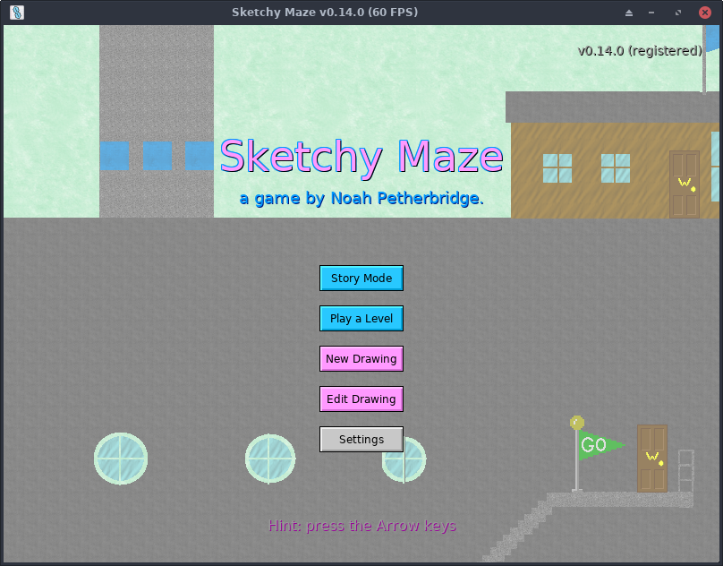

# Welcome to _Sketchy Maze_

[Sketchy Maze](about.md) is a drawing-based maze game themed around hand-drawn maps on paper. You can draw a level for a 2D platformer game, drag-and-drop "doodads" such as buttons and doors into your level, play it and share your levels with others.

**Last Updated:** May 4, 2024 for Sketchy Maze v0.14.0.

## Table of Contents

*   [About Sketchy Maze](about.md)
    *   [Change History](changes.md)
*   [Gameplay Controls](controls.md)
*   [Story Mode](story-mode.md)
*   [Creating Custom Levels](custom-levels/index.md)
    *   [Publishing Levels](custom-levels/publishing.md)
    *   [Level Packs](custom-levels/levelpacks.md)
    *   [Custom Wallpaper](custom-levels/custom-wallpaper.md)
*   [The Built-in Doodads](doodads.md)
*   [Linked Doodads](linked-doodads.md)
*   [Creating Custom Doodads](custom-doodads/index.md)
    *   [Draw Sprites In-Game](custom-doodads/edit-in-game.md)
    *   [Draw Sprites with an External Program](custom-doodads/edit-external.md)
    *   [Program Them with JavaScript](custom-doodads/scripts.md)
*   [Shortcut Keys](hotkeys.md)
*   [The `doodad` command-line tool](doodad-tool.md)
*   [Hacking and debugging](hacking.md)
    *   [Profile Directory](profile-directory.md)
*   [Register Your Game](register.md)
*   [Open Source Licenses](licenses.md)

