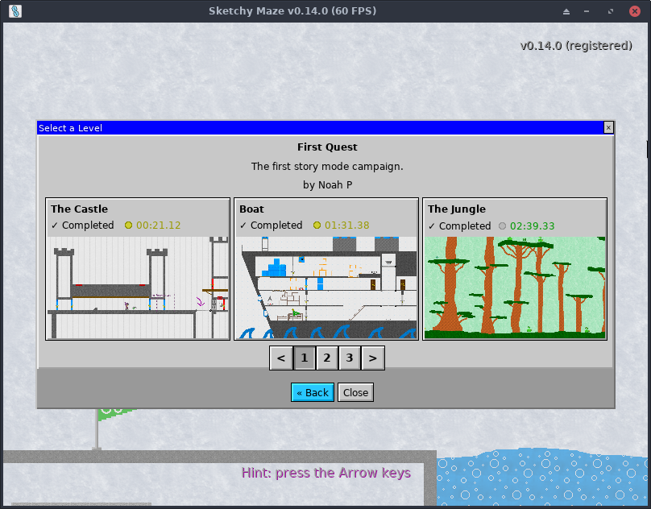

# Story Mode

The primary gameplay feature of Sketchy Maze is its Story Mode.

In Story Mode you can select from a [Level Pack](custom-levels/levelpacks.md) and play through its levels in series and compete for a local high score. Players may also create their own custom Level Packs and these will appear on the Story Mode menu as well.

## High Score

In the Story Mode the player can record high scores on each level they complete. Currently, the high score is based around how quickly the level has been cleared and there are two tiers of scores per level:

*   Perfect Run (gold): you completed the level without dying and restarting from a checkpoint.
*   Best Run (silver): you completed the level but you had died and restarted from a checkpoint.

During gameplay, a timer appears in the corner of the screen accompanied by the gold or silver icon so you can see your current time while playing as well as which High Score tier you're competing for. The icon begins as gold but will turn silver if you run into a fire pixel or otherwise need to respawn from your last checkpoint.

If [cheat codes](hacking.md#cheat-codes) are used, you are not eligible to achieve a high score (the icon next to the timer will disappear) but you may still complete the level and unlock later levels.

## Unlocking Levels

Some Story Mode campaigns have locked levels and only the earliest levels are playable by default. Completing a level will unlock a level, until all of the levels have been unlocked.

You may complete a level by using cheat codes, e.g. for noclip and going straight for the level goal. This will unlock the next level, but you won't be able to record a High Score for completing a level using cheats.

## Azulian Tag

**New in v0.12.0**

Azulian Tag is a game mode in which the player is "It" and they have to avoid being caught by the enemies (an inverted version of the classic game, Tag). _Sketchy Maze_ includes a levelpack of Azulian Tag levels. The key elements of an Azulian Tag map include:

*   Hard difficulty: so all Azulians across the whole level will chase towards the player character.
*   Survival mode: the player is rewarded with a high score (silver medal) for surviving the longest amount of time before dying due to an Azulian or other cause.

Azulian Tag maps should also hide an Exit Flag somewhere to allow players to complete the level with a gold medal (for not dying). The gold medal high score is still based on how quickly the player beats the level, while the silver medal (if they get got by an Azulian) high score is for the longest duration kept alive.

## Backing Up Your Save Game

Your save game file can be backed up and restored to another computer so you don't lose your unlocked levels progression or your high scores. However, this must be handled carefully:

In your [profile directory](profile-directory.md) you'll want to copy your settings.json _and_ savegame.json files. To restore your backup to a different computer, place your settings.json and savegame.json into the profile directory on the new computer.

Notice: if you simply backup the savegame.json but not the settings.json then your savegame file will not be accepted by the game. The two are linked and this is a mild measure to deter cheating by editing your high scores directly.
